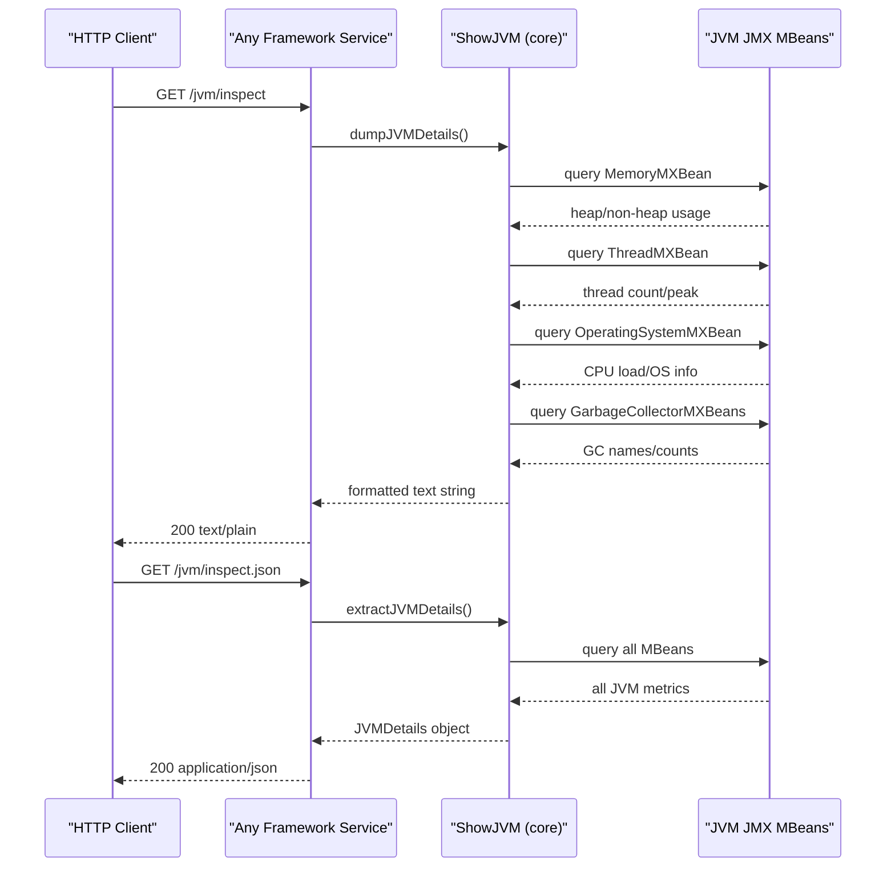

# API & Service Communication Contracts

ShowMyJVM exposes two standardized read-only HTTP endpoints per framework implementation — a plain-text and a JSON introspection endpoint — with no inter-service communication, authentication, or external data dependencies.

## Service Catalog

| Service | Port | Category | Purpose |
|---------|------|----------|---------|
| showmyjvm-springboot | 8080 (default) | API Layer | Spring Boot 4.0 JVM inspection REST service with Actuator |
| showmyjvm-quarkus | 8080 (default) | API Layer | Quarkus 3.30 JAX-RS JVM inspection service |
| showmyjvm-micronaut | 8080 (default) | API Layer | Micronaut 4.8 HTTP server JVM inspection service |
| showmyjvm-helidon | 8080 (default) | API Layer | Helidon SE 4.3 reactive JVM inspection service |
| showmyjvm-helidon-mp | 8080 (default) | API Layer | Helidon MicroProfile 4.3 JAX-RS JVM inspection service |
| showmyjvm-javalin | 8080 (default) | API Layer | Javalin 6.7 lightweight HTTP JVM inspection service |
| showmyjvm-ratpack | 8080 (default) | API Layer | Ratpack 1.10 async HTTP JVM inspection service |
| showmyjvm-sparkjava | 8080 (default) | API Layer | SparkJava 2.9 micro-framework JVM inspection service |
| showmyjvm-tomcat | 8080 (default) | API Layer | Jakarta Servlet 6.1 (Tomcat) JVM inspection service |

All services respect the `PORT` environment variable to override the default port 8080.

## API Endpoints Inventory

| Service | Method | Path | Request Type | Response Type | Notes |
|---------|--------|------|-------------|---------------|-------|
| All (×9) | GET | `/jvm/inspect` | None | `text/plain` | Multi-line formatted JVM introspection output |
| All (×9) | GET | `/jvm/inspect.json` | None | `application/json` | `JVMDetails` object (JSON) |

Each of the nine framework implementations exposes these two identical endpoints. There are no path parameters, query parameters, or request bodies. Total endpoint count: 18 (2 per framework × 9 frameworks).

## Management & Observability Endpoints

| Service | Endpoint | Notes |
|---------|----------|-------|
| showmyjvm-springboot | `/actuator` | Spring Boot Actuator base path (enabled via `spring-boot-starter-actuator`) |
| showmyjvm-springboot | `/actuator/health` | Liveness/readiness health check |
| showmyjvm-springboot | `/actuator/info` | Application info endpoint |
| showmyjvm-helidon-mp | `/health` | Helidon MicroProfile Health API endpoint |
| showmyjvm-helidon-mp | `/metrics` | Helidon MicroProfile Metrics endpoint |
| showmyjvm-helidon-mp | `/openapi` | Helidon MicroProfile OpenAPI descriptor |

No custom `@Timed` or Micrometer metric annotations were found in any controller. The remaining seven frameworks (Quarkus, Micronaut, Javalin, Ratpack, SparkJava, Tomcat, Helidon SE) expose no management endpoints beyond the two business endpoints.

## DTOs & Contracts

**Response Model**: `JVMDetails` (package `io.brunoborges.showmyjvm.core`) is the sole API response DTO, used by all nine services for the `/jvm/inspect.json` endpoint. It is a plain Java POJO (not a record or Lombok-annotated class) that aggregates all JVM introspection data. It is mutable with public setters. For full field details see `data-architecture.md`.

**No request DTOs** are defined — both endpoints are parameterless GET operations.

**Serialization**: Jackson Databind is used by Spring Boot, Quarkus, Micronaut, and Javalin. Jakarta JSON Bind (Yasson) is used by Tomcat and Helidon MP. The Spring Boot module enables pretty-printing via `spring.jackson.serialization.indent_output=true`. No OpenAPI/Swagger specs, `.proto` files, or GraphQL schemas were found.

## Communication Patterns

**Synchronous only**: All nine services handle HTTP requests synchronously (or with framework-native async I/O). There are no inter-service calls, message queues, event buses, or external API dependencies. Each service is fully self-contained.

**No inter-service communication**: Because all services perform identical JVM introspection independently, there is no gateway aggregation, service-to-service calls, circuit breakers, retry policies, or service discovery. Each module runs as a standalone process.

**No authentication or TLS configured**: All endpoints are publicly accessible with no authentication, authorization, or TLS. There are no Spring Security, MicroProfile JWT, or other auth dependencies declared. This is intentional for a local demonstration tool, but would require hardening before production deployment.

**Startup order**: Each service starts independently with no dependency chain. Port binding is the only startup prerequisite; no external services need to be available before the application is ready.

## Service Technology Matrix

| Service | Web Framework | Data Access | Discovery | Gateway | Actuator/Health | Cache | Metrics |
|---------|--------------|-------------|-----------|---------|-----------------|-------|---------|
| Spring Boot | Spring MVC (Servlet) | None | None | None | Spring Actuator | None | Actuator metrics |
| Quarkus | Quarkus REST (RESTEasy) | None | None | None | None | None | None |
| Micronaut | Micronaut HTTP / Netty | None | None | None | None | None | None |
| Helidon SE | Helidon SE HTTP | None | None | None | None | None | None |
| Helidon MP | Helidon MicroProfile | None | None | None | MP Health | None | MP Metrics |
| Javalin | Javalin (Jetty) | None | None | None | None | None | None |
| Ratpack | Ratpack (Netty) | None | None | None | None | None | None |
| SparkJava | SparkJava (Jetty) | None | None | None | None | None | None |
| Tomcat | Jakarta Servlet (Tomcat) | None | None | None | None | None | None |

## Service Communication Sequence

