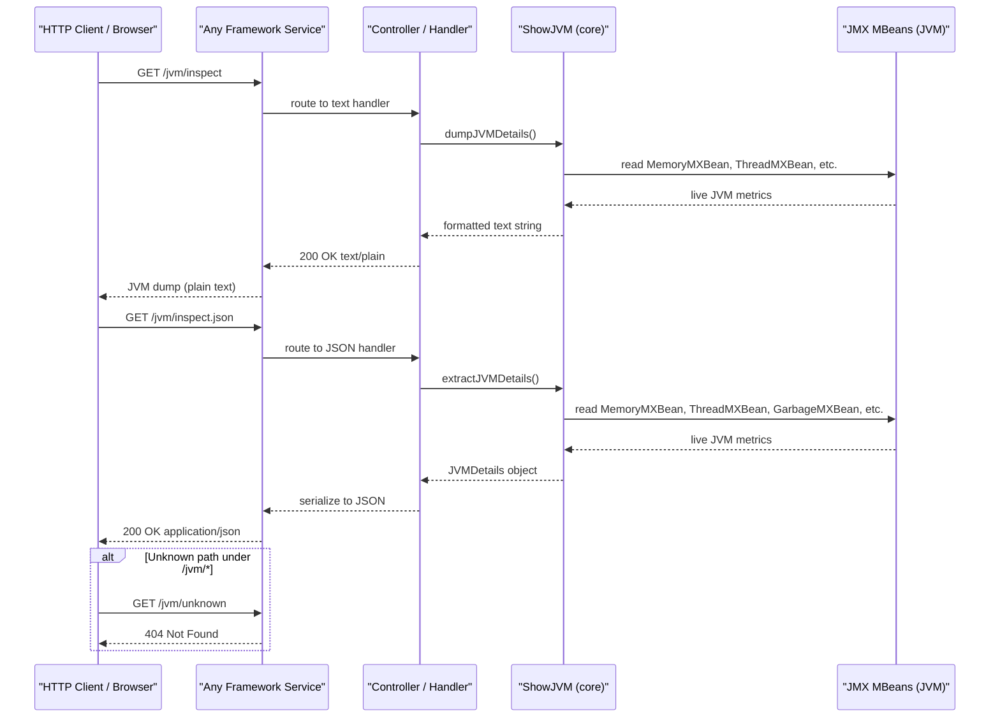

# API & Service Communication Contracts

ShowMyJVM exposes two read-only HTTP endpoints across nine independently deployable Java service implementations, all sharing identical API contracts with no inter-service communication or authentication.

## Service Catalog

| Service | Default Port | Category | Purpose | Key Framework |
|---------|-------------|----------|---------|---------------|
| showmyjvm-spring-boot | 8080 | Business | JVM introspection via Spring Boot REST | Spring Boot 4.0 |
| showmyjvm-quarkus | 8080 | Business | JVM introspection via Quarkus JAX-RS | Quarkus 3.30.3 |
| showmyjvm-micronaut | 8080 | Business | JVM introspection via Micronaut HTTP | Micronaut 4.8.3 |
| showmyjvm-helidon | 8080 | Business | JVM introspection via Helidon SE WebServer | Helidon 4.3.2 |
| showmyjvm-helidon-mp | 8080 | Business | JVM introspection via Helidon MicroProfile JAX-RS | Helidon MP 4.3.2 |
| showmyjvm-javalin | 8080 | Business | JVM introspection via Javalin | Javalin 6.7.0 |
| showmyjvm-ratpack | 8080 | Business | JVM introspection via Ratpack | Ratpack 1.10.0-m39 |
| showmyjvm-sparkjava | 8080 | Business | JVM introspection via SparkJava | SparkJava 2.9.4 |
| showmyjvm-tomcat | 8080 | Business | JVM introspection via Jakarta Servlet on Tomcat | Jakarta Servlet 6.1 |
| aspire-apphost | N/A | Infrastructure | .NET Aspire AppHost for local container orchestration | .NET Aspire 9.5.2 |

All services accept the `PORT` environment variable to override the default port of 8080.

## API Endpoints Inventory

All nine service implementations expose exactly the same two endpoints under the `/jvm` path prefix:

| Service | Method | Path | Request Type | Response Type | Content-Type |
|---------|--------|------|-------------|--------------|-------------|
| All services | GET | `/jvm/inspect` | None (no parameters) | Plain text JVM dump | `text/plain` |
| All services | GET | `/jvm/inspect.json` | None (no parameters) | `JVMDetails` JSON object | `application/json` |

Path parameters: none. Query parameters: none. Request body: none. Both endpoints are idempotent and safe (read-only).

Error handling (Tomcat explicitly, others via framework defaults):
- `404 Not Found` — returned when a path other than `/inspect` or `/inspect.json` is requested under `/jvm/*` (Tomcat servlet only).
- `500 Internal Server Error` — returned on unhandled exceptions from the JVM introspection logic.

## Management & Observability Endpoints

| Service | Endpoint | Purpose | Notes |
|---------|---------|---------|-------|
| showmyjvm-spring-boot | `/actuator/health` | Health check | Spring Boot Actuator (spring-boot-starter-actuator included) |
| showmyjvm-spring-boot | `/actuator/info` | Application info | Spring Boot Actuator |
| showmyjvm-spring-boot | `/actuator/metrics` | Micrometer metrics | Spring Boot Actuator |
| showmyjvm-helidon | `/observe/health` | Health check | Helidon Observe health module |
| showmyjvm-helidon | `/observe/metrics` | System metrics | Helidon Metrics System Meters |
| showmyjvm-helidon-mp | `/health` | MicroProfile Health | Helidon MP Health |
| showmyjvm-helidon-mp | `/openapi` | OpenAPI spec | Helidon MP OpenAPI |
| showmyjvm-helidon-mp | `/metrics` | MicroProfile Metrics | Disabled by default (`metrics.rest-request.enabled=false`) |

Custom metrics: none defined beyond the framework defaults.

## DTOs & Contracts

**`JVMDetails`** (in `showmyjvm-core`): The single shared response DTO returned by the JSON endpoint across all nine implementations. It is a mutable POJO (not a Java record) populated via setter-style builder methods in `ShowJVM`. It is serialized to JSON by the host framework's default serializer (Jackson in Spring Boot/Quarkus/Javalin/SparkJava/Micronaut, Jakarta JSON-B in Tomcat/Helidon MP, custom media support in Helidon SE). See `data-architecture.md` for the full field inventory.

**Plain-text response**: The `/jvm/inspect` endpoint returns the output of `ShowJVM.dumpJVMDetails()` as an unstructured multi-line string — no DTO class is involved.

There are no OpenAPI/Swagger YAML/JSON specifications committed to the repository (Helidon MP generates one at runtime via `/openapi`). There are no protobuf schemas or GraphQL schemas. No versioning scheme is applied to the API paths.

## Communication Patterns

**Synchronous HTTP only**: All inter-client communication is standard synchronous HTTP request/response. There is no inter-service communication — each of the nine services is an independent deployment that does not call any other service. The .NET Aspire AppHost orchestrates container startup locally but does not add a gateway or proxy layer.

**No asynchronous messaging**: No message brokers (Kafka, RabbitMQ, Azure Service Bus) are used. There are no event-driven flows.

**No resilience patterns**: No circuit breakers (Resilience4j, Polly), retry policies, bulkheads, or explicit timeout configuration are present. The application is stateless and read-only, so resilience patterns are not applicable.

**No service discovery**: Services are addressed by direct URL. The Aspire AppHost configures a static container port (`8090 → 8080`) for the Tomcat container; other services are started independently.

**No API gateway**: There is no gateway, reverse proxy, or load balancer layer in the codebase. The Aspire AppHost is a developer-inner-loop orchestrator, not a production gateway.

**Security posture**: No authentication, authorization, or TLS is configured at the API level in any of the nine implementations. All endpoints (`/jvm/inspect`, `/jvm/inspect.json`, and management endpoints) are publicly accessible with no credentials or role checks required. This is by design for a local JVM diagnostic tool; however, if any implementation is deployed to a network-accessible environment, access control must be added externally (network policy, reverse proxy, or application-level security).

**Startup order**: Each service is independently startable. The Aspire AppHost starts the Tomcat container image; all other services are started manually by developers. There are no Kubernetes readiness probes or Docker Compose `depends_on` chains in the repository.

## Service Technology Matrix

| Service | Web Layer | Data Access | Discovery | Gateway | Actuator / Health | Cache | Metrics |
|---------|-----------|-------------|-----------|---------|-------------------|-------|---------|
| spring-boot | Spring MVC | JMX (direct) | None | None | Spring Actuator | None | Micrometer (Actuator) |
| quarkus | JAX-RS / RESTEasy | JMX (direct) | None | None | Quarkus default | None | None |
| micronaut | Micronaut HTTP Netty | JMX (direct) | None | None | None | None | None |
| helidon | Helidon SE WebServer | JMX (direct) | None | None | Helidon Observe | None | Helidon Metrics |
| helidon-mp | JAX-RS / Helidon MP | JMX (direct) | None | None | MicroProfile Health | None | MicroProfile Metrics |
| javalin | Javalin (Jetty) | JMX (direct) | None | None | None | None | None |
| ratpack | Ratpack (Netty) | JMX (direct) | None | None | None | None | None |
| sparkjava | SparkJava (Jetty) | JMX (direct) | None | None | None | None | None |
| tomcat | Jakarta Servlet | JMX (direct) | None | None | None | None | None |
| aspire-apphost | N/A (.NET) | N/A | None | None | None | None | None |

## Service Communication Sequence

