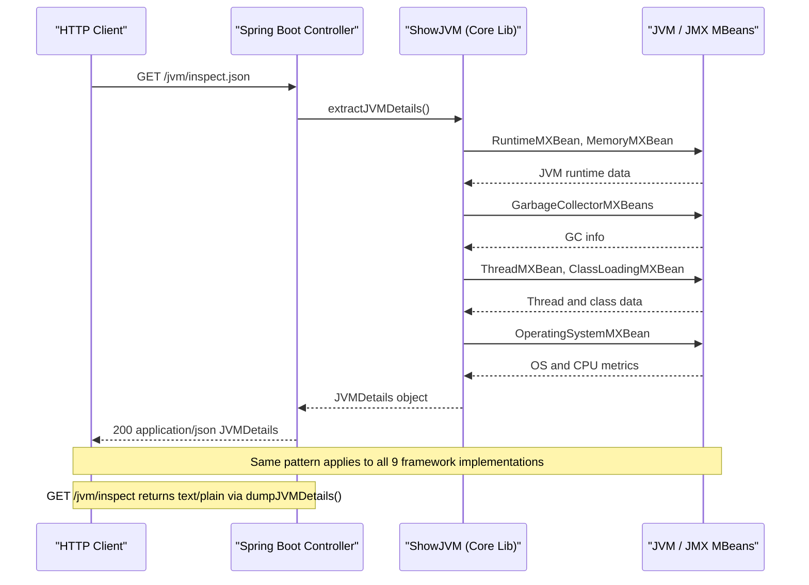

# API & Service Communication Contracts

ShowMyJVM exposes two standardized HTTP endpoints across nine independent framework implementations. All services are stateless, synchronous, and serve read-only JVM introspection data with no authentication or inter-service communication.

## Service Catalog

| Service | Port | Category | Purpose |
|---------|------|----------|---------|
| showmyjvm-springboot | 8080 (PORT env) | API Layer | Spring Boot 4.0 REST implementation with Actuator |
| showmyjvm-quarkus | 8080 (PORT env) | API Layer | Quarkus 3.30 JAX-RS REST implementation |
| showmyjvm-micronaut | 8080 (PORT env) | API Layer | Micronaut 4.8 declarative REST implementation |
| showmyjvm-helidon (SE) | 8080 (PORT env) | API Layer | Helidon SE 4.3 reactive HTTP server |
| showmyjvm-helidon-mp | 8080 (PORT env) | API Layer | Helidon MicroProfile 4.3 JAX-RS implementation |
| showmyjvm-javalin | 8080 (PORT env) | API Layer | Javalin 6.7 lightweight REST implementation |
| showmyjvm-ratpack | 8080 (PORT env) | API Layer | Ratpack 1.10 async HTTP implementation |
| showmyjvm-sparkjava | 8080 (PORT env) | API Layer | SparkJava 2.9 micro-framework REST implementation |
| showmyjvm-tomcat | 8080 (PORT env) | API Layer | Jakarta Servlet deployed on embedded Tomcat |

All services default to port 8080 and respect the `PORT` environment variable. Each implementation runs independently — they are not deployed together.

## API Endpoints Inventory

All nine services expose the same two endpoints:

| Service | Method | Path | Request Type | Response Type | Content-Type |
|---------|--------|------|-------------|--------------|--------------|
| All (Spring Boot) | GET | /jvm/inspect | none | String (plain text) | text/plain |
| All (Spring Boot) | GET | /jvm/inspect.json | none | JVMDetails (JSON) | application/json |
| All (Quarkus) | GET | /jvm/inspect | none | String (plain text) | text/plain |
| All (Quarkus) | GET | /jvm/inspect.json | none | JVMDetails (JSON) | application/json |
| All (Micronaut) | GET | /jvm/inspect | none | String (plain text) | text/plain |
| All (Micronaut) | GET | /jvm/inspect.json | none | JVMDetails (JSON) | application/json |
| All (Helidon SE) | GET | /inspect | none | String (plain text) | text/plain |
| All (Helidon SE) | GET | /inspect.json | none | JVMDetails (JSON) | application/json |
| All (Helidon MP) | GET | /jvm/inspect | none | String (plain text) | text/plain |
| All (Helidon MP) | GET | /jvm/inspect.json | none | JVMDetails (JSON) | application/json |
| All (Javalin) | GET | /jvm/inspect | none | String (plain text) | text/plain |
| All (Javalin) | GET | /jvm/inspect.json | none | JVMDetails (JSON) | application/json |
| All (Ratpack) | GET | /jvm/inspect | none | String (plain text) | text/plain |
| All (Ratpack) | GET | /jvm/inspect.json | none | JVMDetails (JSON) | application/json |
| All (SparkJava) | GET | /jvm/inspect | none | String (plain text) | text/plain |
| All (SparkJava) | GET | /jvm/inspect.json | none | JVMDetails (JSON) | application/json |
| All (Tomcat Servlet) | GET | /jvm/inspect | none | String (plain text) | text/plain |
| All (Tomcat Servlet) | GET | /jvm/inspect.json | none | JVMDetails (JSON) | application/json |

> Note: Helidon SE registers routes under `/inspect` and `/inspect.json` (without the `/jvm` prefix), while all other implementations use `/jvm/inspect` and `/jvm/inspect.json`.

## Management & Observability Endpoints

| Service | Endpoint | Notes |
|---------|----------|-------|
| showmyjvm-springboot | /actuator/health | Spring Boot Actuator health check |
| showmyjvm-springboot | /actuator/info | Application info |
| showmyjvm-springboot | /actuator/metrics | Micrometer metrics |
| showmyjvm-helidon (SE) | /observe/health | Helidon built-in health check |
| showmyjvm-helidon (SE) | /observe/metrics | Helidon metrics observer |
| showmyjvm-helidon-mp | /health | MicroProfile Health API |
| showmyjvm-helidon-mp | /openapi | MicroProfile OpenAPI spec |

No custom `@Timed` or metric registrations are present in the application source code. All observability is provided by built-in framework defaults.

## DTOs & Contracts

The sole response DTO is `JVMDetails` (package `io.brunoborges.showmyjvm.core`), a plain Java object (POJO) used as both the JSON response type for `/jvm/inspect.json` and the internal data model populated by `ShowJVM`. It is a service-level domain entity — not a gateway aggregation model — and holds all extracted JVM metrics in a single flat structure.

`JVMDetails` is not immutable (no `@Value`, `record`, or final fields at the class level). Serialization is handled by each framework's default JSON provider: Jackson (Spring Boot, Quarkus, Javalin, SparkJava, Ratpack), Micronaut Jackson Databind (Micronaut), or Jakarta JSON Binding / Yasson (Helidon SE, Helidon MP, Tomcat). For full field-level details, see `data-architecture.md`.

No OpenAPI/Swagger specification files, protobuf schemas, or GraphQL schemas are present in the repository.

## Communication Patterns

**Synchronous**: All nine services use synchronous HTTP request-response with no inter-service calls. Each service independently processes every request by calling `ShowJVM` directly in the handler method — there is no remote service invocation, no message queue, and no shared state between requests.

**Asynchronous**: No asynchronous messaging, event-driven patterns, or message brokers are present.

**Resilience patterns**: No circuit breakers, retry policies, timeout configuration, or bulkhead patterns are implemented. The only failure path is an unhandled exception propagating to the framework's default error handler.

**Service discovery**: Not applicable — each module is an independent, standalone service. No Eureka, Consul, or Kubernetes DNS service registration is present.

**API gateway**: No API gateway is present. Each service is accessed directly by clients.

**Gateway aggregation/composition**: Not applicable — each service is self-contained with no downstream dependencies.

**Startup dependency chain**: Each service starts independently with no dependencies on other services. The `PORT` environment variable is read at startup.

**Security posture**: No authentication, authorization, or TLS is configured in any of the nine implementations. All endpoints (`/jvm/inspect`, `/jvm/inspect.json`) are publicly accessible with no access controls. Spring Boot's Actuator endpoints are also exposed without authentication. This is appropriate for a demo/introspection tool but must be addressed before any production or multi-tenant deployment.

## Service Technology Matrix

| Service | Web Framework | Data Access | Discovery | Gateway | Actuator/Health | Cache | Metrics |
|---------|--------------|------------|-----------|---------|-----------------|-------|---------|
| Spring Boot | Spring MVC | None | None | None | Spring Actuator | None | Micrometer |
| Quarkus | JAX-RS (RESTEasy) | None | None | None | None | None | None |
| Micronaut | Micronaut HTTP (Netty) | None | None | None | None | None | None |
| Helidon SE | Helidon WebServer | None | None | None | Health/Metrics observer | None | Helidon Metrics |
| Helidon MP | JAX-RS (MicroProfile) | None | None | None | MicroProfile Health | None | MicroProfile Metrics |
| Javalin | Javalin (Jetty) | None | None | None | None | None | None |
| Ratpack | Ratpack (Netty) | None | None | None | None | None | None |
| SparkJava | SparkJava (Jetty) | None | None | None | None | None | None |
| Tomcat | Jakarta Servlet | None | None | None | None | None | None |

## Service Communication Sequence

