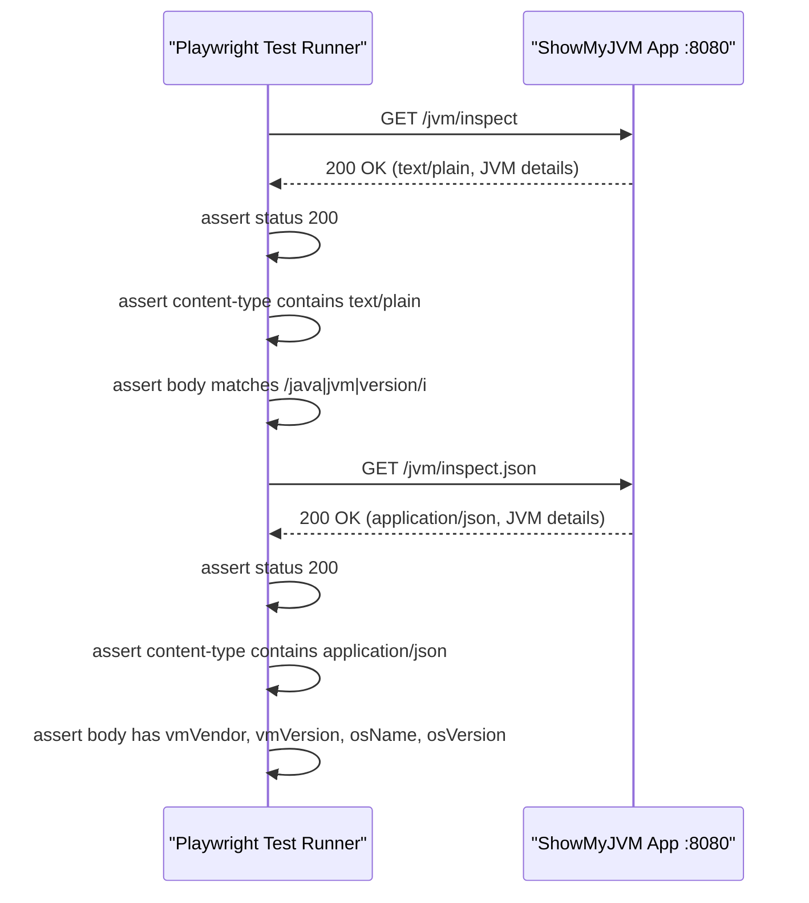

# API & Service Communication Contracts

The `showmyjvm-e2e-tests` project is a pure test client that exercises **2 HTTP endpoints** exposed by each ShowMyJVM framework implementation, using synchronous HTTP GET requests with no authentication or service-to-service composition.

## Service Catalog

| Service | Port | Category | Purpose |
|---|---|---|---|
| ShowMyJVM Framework (under test) | 8080 (default) | Business / API Layer | Any one of the nine JVM framework implementations serving JVM introspection endpoints |
| Playwright Test Runner | N/A (test process) | Observability | Executes HTTP assertions against the running framework instance |

## API Endpoints Inventory

The endpoints below are **tested by** this project — they are defined in the ShowMyJVM framework implementations (not in this test project itself).

| Service | Method | Path | Request Type | Response Type |
|---|---|---|---|---|
| ShowMyJVM (any framework) | GET | `/jvm/inspect` | None (no request body or query params) | `text/plain` — multi-line JVM details |
| ShowMyJVM (any framework) | GET | `/jvm/inspect.json` | None (no request body or query params) | `application/json` — structured JVM details object |

> Note: Endpoint definitions live in the framework-specific controller classes (e.g., `JvmInspectController`, `JvmInspectHandler`) in the parent repository modules. This test project only consumes them.

## Management & Observability Endpoints

| Service | Endpoint | Custom Metrics |
|---|---|---|
| ShowMyJVM (any framework) | `/jvm/inspect` | None — this IS the observability endpoint (exposes JVM runtime state) |
| ShowMyJVM (any framework) | `/jvm/inspect.json` | None — JSON variant of the same JVM state snapshot |
| Playwright Test Runner | N/A | Generates HTML test report (`playwright-report/`) after each run |

No Spring Boot Actuator, Micrometer, Prometheus, or custom health-check endpoints are defined or tested by this project.

## DTOs & Contracts

The JSON response contract (tested by `showmyjvm.spec.ts`) is implicitly defined by the assertions in the test file:

**Expected JSON response shape for `/jvm/inspect.json`:**
- `vmVendor` (string) — JVM vendor name
- `vmVersion` (string) — JVM version string
- `osName` (string) — operating system name
- `osVersion` (string) — operating system version

These four fields are the minimum contract validated by the E2E tests. The actual JSON payload produced by the framework implementations (defined in `core/JVMDetails.java`) contains additional fields; the tests only assert on the presence and type of the four above. There are no OpenAPI/Swagger specifications, protobuf schemas, or GraphQL schemas in this test project. No serialization configuration exists on the test side — deserialization is handled by Playwright's built-in `response.json()` method.

## Communication Patterns

**Synchronous HTTP only.** The test suite uses Playwright's `APIRequestContext` to issue synchronous `GET` requests to `http://localhost:8080`. There are no asynchronous, event-driven, or messaging patterns.

**No service discovery** — the base URL is hardcoded in `playwright.config.ts` as `http://localhost:8080`. The target framework instance must be started manually (or via `test-all.sh`) before the tests are run.

**No resilience patterns** — there is no circuit breaker, retry policy, or timeout configuration beyond Playwright's default request timeout. If the server is unavailable the test fails immediately.

**No API gateway** — tests communicate directly with the single running framework instance.

**Security posture:** No authentication, authorization, or TLS is configured in the test suite or required by the tested endpoints. All endpoints are accessed over plain HTTP with no credentials. The `playwright.config.ts` explicitly targets `http://` (not `https://`). This is intentional for local/CI testing environments.

**Startup dependency:** The framework application must be running and accepting requests on port 8080 before the Playwright tests are invoked. The `test-all.sh` script handles the start/stop lifecycle when running the full matrix.

## Service Technology Matrix

| Service | Web | Data Access | Discovery | Gateway | Health Check | Cache | Metrics |
|---|---|---|---|---|---|---|---|
| Playwright Test Runner | Playwright APIRequestContext | None | None (hardcoded URL) | None | None | None | HTML report only |
| ShowMyJVM (under test) | Framework-specific (Spring/Quarkus/etc.) | None (read-only JMX) | None | None | None | None | JVM introspection via JMX |

## Service Communication Sequence

