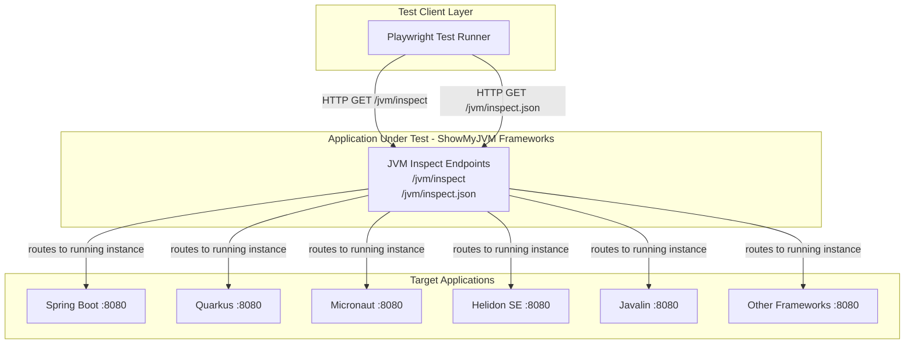
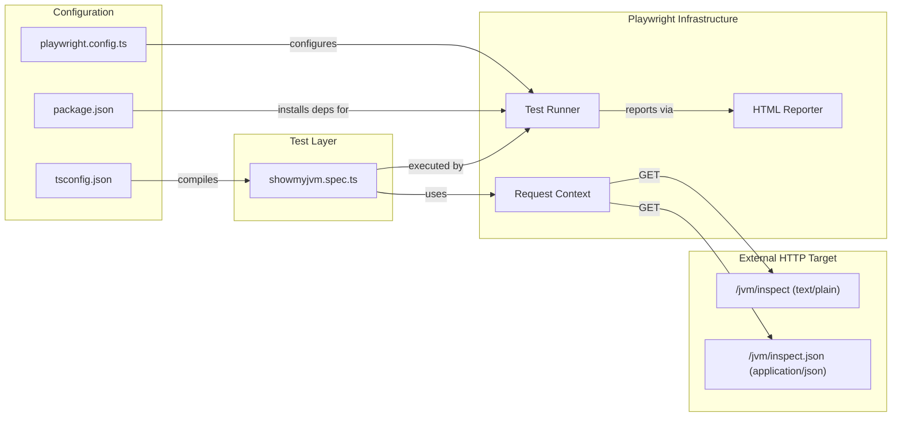

# Architecture Diagram

This document describes the architecture of the ShowMyJVM E2E test suite — a TypeScript/Playwright project that validates JVM introspection endpoints across multiple framework implementations.

## Application Architecture

### Technology Stack Summary

| Layer | Technology | Version | Purpose |
|---|---|---|---|
| Test Framework | Playwright | ^1.48.0 | Browser and API end-to-end testing |
| Language | TypeScript | via tsconfig (ES2020) | Type-safe test authoring |
| Runtime | Node.js | 22.x | JavaScript/TypeScript execution environment |
| Type Definitions | @types/node | ^22.0.0 | Node.js type definitions for TypeScript |
| Test Reporter | Playwright HTML Reporter | built-in | HTML test result reports |

### Data Storage & External Services

The E2E test suite itself has no data storage layer. It communicates over HTTP with whichever ShowMyJVM framework implementation is running locally on `http://localhost:8080`. The applications under test expose two endpoints (`/jvm/inspect` for plain text and `/jvm/inspect.json` for JSON), and the tests assert on HTTP status codes, content types, and response body structure.

### Key Architectural Decisions

- **API testing via Playwright request fixtures** — tests use the Playwright `request` API context rather than browser automation, making them lightweight HTTP assertion checks against live endpoints.
- **Single base URL, multiple projects** — `playwright.config.ts` defines a single `baseURL` (`localhost:8080`) shared across all named framework projects, enabling one test file to validate every implementation without code duplication.
- **CI-aware parallelism** — workers are capped to 1 in CI mode (`process.env.CI`) and fully parallel locally, balancing isolation with speed.

## Component Relationships

### Component Inventory

| Component | Layer | Type | Responsibility |
|---|---|---|---|
| `playwright.config.ts` | Configuration | Playwright config | Defines base URL, projects, retry/parallel settings, and reporter |
| `tsconfig.json` | Configuration | TypeScript config | Compiler options (ES2020 target, strict mode, module resolution) |
| `package.json` | Configuration | npm manifest | Declares devDependencies and test runner scripts |
| `showmyjvm.spec.ts` | Test Layer | Playwright spec | Contains the two API test cases for `/jvm/inspect` and `/jvm/inspect.json` |
| Test Runner | Playwright Infrastructure | Runtime | Discovers and executes specs, manages retries and parallel workers |
| HTML Reporter | Playwright Infrastructure | Reporter | Generates an HTML report of test results |
| Request Context | Playwright Infrastructure | HTTP client | Issues HTTP requests and captures responses for assertions |
| `/jvm/inspect` endpoint | External Target | HTTP endpoint | Returns JVM runtime details as `text/plain` |
| `/jvm/inspect.json` endpoint | External Target | HTTP endpoint | Returns JVM runtime details as `application/json` |
