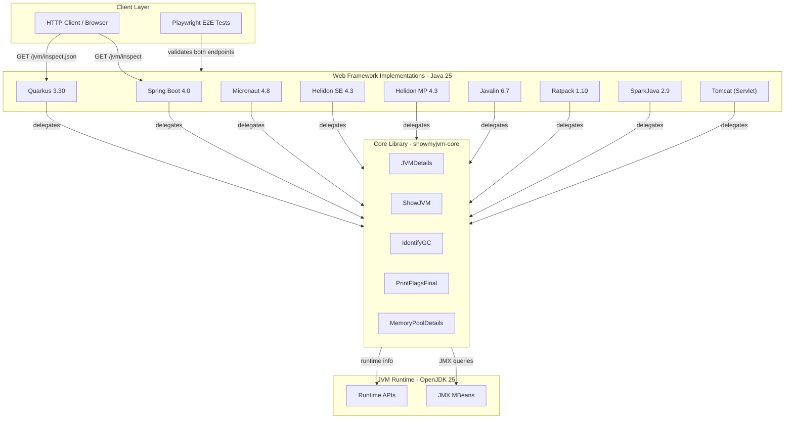
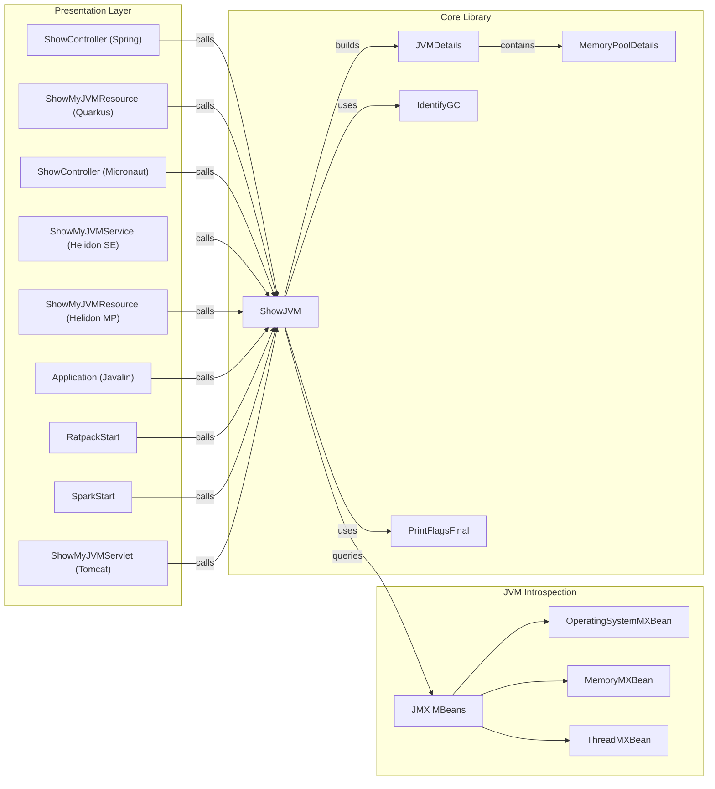

# Architecture Diagram

ShowMyJVM is a Maven multi-module Java project that demonstrates JVM introspection across nine web framework implementations. Each framework module exposes standardized HTTP endpoints backed by a shared core library.

## Application Architecture

### Technology Stack Summary

| Layer | Technology | Version | Purpose |
|-------|-----------|---------|---------|
| Build | Maven (multi-module) | 3.9.1+ | Project build and dependency management |
| BOM | showmyjvm-bom | 1.0.0-SNAPSHOT | Centralized dependency/plugin version management |
| Core Library | showmyjvm-core | 1.0.0-SNAPSHOT | JVM introspection via JMX and Java APIs |
| Framework | Spring Boot | 4.0.0 | REST web framework with Actuator |
| Framework | Quarkus | 3.30.3 | Cloud-native Java framework |
| Framework | Micronaut | 4.8.3 | Dependency injection microframework |
| Framework | Helidon SE | 4.3.2 | Reactive microservices framework |
| Framework | Helidon MP | 4.3.2 | MicroProfile-based framework |
| Framework | Javalin | 6.7.0 | Lightweight HTTP framework |
| Framework | Ratpack | 1.10.0-milestone-39 | Asynchronous HTTP framework |
| Framework | SparkJava | 2.9.4 | Micro web framework |
| Framework | Tomcat | (Servlet 6.x) | Servlet container via Cargo plugin |
| Runtime | OpenJDK | 25 | Java runtime environment |
| Serialization | Jackson Databind | 2.20.1 | JSON serialization |
| Logging | SLF4J | 2.0.16 | Logging facade |
| Testing | JUnit Jupiter | 5.11.4 | Unit testing framework |
| E2E Testing | Playwright (Node.js) | latest | Browser-based end-to-end testing |
| Containerization | Jib Maven Plugin | 3.5.1 | Container image builds (no Dockerfile) |

### Data Storage & External Services

ShowMyJVM has **no persistent data storage** — it is a stateless, read-only introspection tool. All data is obtained at runtime from the JVM itself via JMX MBeans and standard Java Management APIs. There are no databases, caches, message brokers, or external API dependencies. The only external integration is container registry publishing via the Jib plugin during CI/CD builds.

### Key Architectural Decisions

- **Module separation**: A single `core` library provides all JVM introspection logic; each framework module is a thin adapter that routes HTTP requests to core methods, enabling framework comparisons without duplicating business logic.
- **BOM-driven versioning**: All dependency and plugin versions are managed centrally in `bom/pom.xml`, ensuring consistency across nine framework modules.
- **PORT environment variable**: All framework implementations respect the `PORT` environment variable (defaulting to 8080), enabling flexible deployment without code changes.

## Component Relationships

### Component Inventory

| Component | Layer | Type | Responsibility |
|-----------|-------|------|----------------|
| ShowController (Spring) | Presentation | REST Controller | Maps `/jvm/inspect` and `/jvm/inspect.json` for Spring Boot |
| ShowMyJVMResource (Quarkus) | Presentation | JAX-RS Resource | Maps `/jvm/inspect` and `/jvm/inspect.json` for Quarkus |
| ShowController (Micronaut) | Presentation | HTTP Controller | Maps `/jvm/inspect` and `/jvm/inspect.json` for Micronaut |
| ShowMyJVMService (Helidon SE) | Presentation | Helidon Service | Maps `/jvm/inspect` and `/jvm/inspect.json` for Helidon SE |
| ShowMyJVMResource (Helidon MP) | Presentation | JAX-RS Resource | Maps `/jvm/inspect` and `/jvm/inspect.json` for Helidon MP |
| Application (Javalin) | Presentation | Javalin Handler | Maps `/jvm/inspect` and `/jvm/inspect.json` for Javalin |
| RatpackStart | Presentation | Ratpack Handler | Maps `/jvm/inspect` and `/jvm/inspect.json` for Ratpack |
| SparkStart | Presentation | Spark Route | Maps `/jvm/inspect` and `/jvm/inspect.json` for SparkJava |
| ShowMyJVMServlet | Presentation | HttpServlet | Handles both endpoint paths for Tomcat |
| ShowJVM | Core Library | Facade | Aggregates all JVM introspection data into a JVMDetails object |
| JVMDetails | Core Library | Data Model | Holds all collected JVM metrics (memory, GC, threads, flags) |
| IdentifyGC | Core Library | Utility | Detects the active garbage collector algorithm |
| PrintFlagsFinal | Core Library | Utility | Extracts JVM flags with their origin (default/command-line/ergonomic) |
| MemoryPoolDetails | Core Library | Data Model | Represents individual JVM memory pool metrics |
