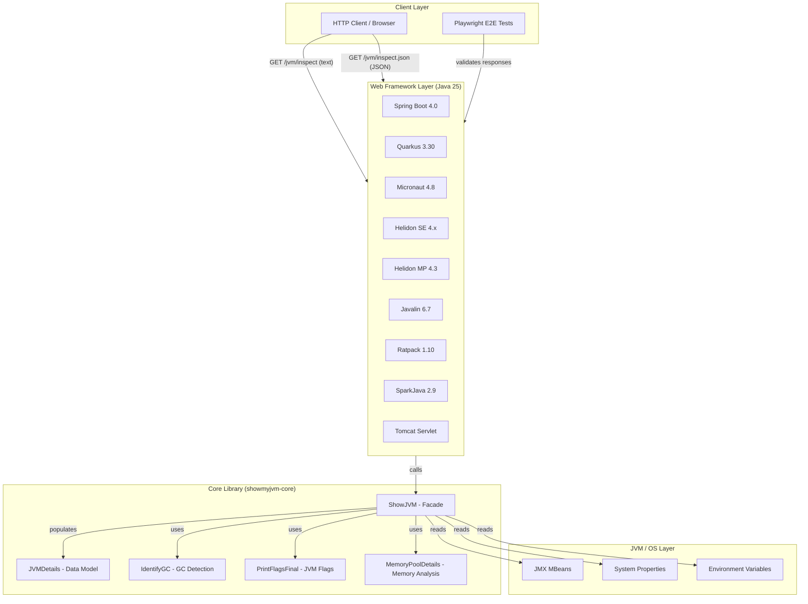
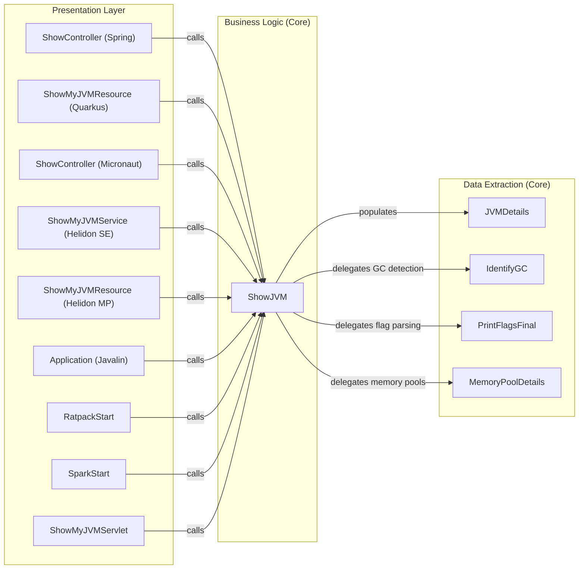

# Architecture Diagram

ShowMyJVM is a Maven multi-module Java 25 project that demonstrates JVM introspection through a shared core library exposed via nine distinct web framework implementations. Each framework module serves two standardized endpoints for plain-text and JSON JVM analysis.

## Application Architecture

### Technology Stack Summary

| Layer | Technology | Version | Purpose |
|-------|-----------|---------|---------|
| Build | Maven | 3.9.1+ | Multi-module project build |
| Language | Java | 25 | Runtime and compilation target |
| Core Library | showmyjvm-core | 1.0.0-SNAPSHOT | JVM introspection facade |
| Web Framework | Spring Boot | 4.0.0 | REST API with Actuator |
| Web Framework | Quarkus | 3.30.3 | Cloud-native REST (JAX-RS) |
| Web Framework | Micronaut | 4.8.3 | DI-based REST framework |
| Web Framework | Helidon SE | 4.x | Reactive web server |
| Web Framework | Helidon MP | 4.3.2 | MicroProfile REST |
| Web Framework | Javalin | 6.7.0 | Lightweight REST |
| Web Framework | Ratpack | 1.10.0-milestone | Async HTTP |
| Web Framework | SparkJava | 2.9.4 | Micro web framework |
| Web Framework | Tomcat | embedded | Servlet-based deployment |
| Serialization | Jackson | 2.20.1 | JSON serialization |
| Containerization | Jib | 3.5.1 | Container image builds |
| E2E Testing | Playwright | latest | Browser-based test automation |

### Data Storage & External Services

ShowMyJVM has no persistent data storage or external service dependencies. All data is sourced at runtime from the JVM itself via JMX MBeans, system properties, and environment variables. The core library reads memory pools, garbage collector information, thread counts, CPU metrics, and JVM flags directly from the running JVM process. There are no databases, caches, message brokers, or third-party APIs involved.

### Key Architectural Decisions

- **Single shared core library**: All nine framework implementations share `showmyjvm-core` as a dependency, ensuring consistent JVM introspection logic across frameworks while each module handles only HTTP routing and content negotiation.
- **Multi-module Maven BOM**: A dedicated `bom/` module centralizes all dependency versions and plugin management, enforcing consistent versions across all framework modules via Maven parent inheritance.
- **Container-ready by default**: Every framework module uses the Jib Maven plugin for containerization without requiring a Dockerfile, and all modules respect a `PORT` environment variable defaulting to 8080.

## Component Relationships

### Component Inventory

| Component | Layer | Type | Responsibility |
|-----------|-------|------|---------------|
| ShowController (Spring) | Presentation | Spring REST Controller | Maps `/jvm/inspect` and `/jvm/inspect.json` for Spring Boot |
| ShowMyJVMResource (Quarkus) | Presentation | JAX-RS Resource | Maps `/jvm/inspect` and `/jvm/inspect.json` for Quarkus |
| ShowController (Micronaut) | Presentation | Micronaut Controller | Maps `/jvm/inspect` and `/jvm/inspect.json` for Micronaut |
| ShowMyJVMService (Helidon SE) | Presentation | Helidon WebServer Service | Registers routes for Helidon SE reactive server |
| ShowMyJVMResource (Helidon MP) | Presentation | MicroProfile JAX-RS Resource | Maps endpoints for Helidon MP |
| Application (Javalin) | Presentation | Javalin App Entry Point | Defines routes inline for Javalin server |
| RatpackStart | Presentation | Ratpack Handler | Sets up async Ratpack routing |
| SparkStart | Presentation | SparkJava Entry Point | Defines Spark routes for inspect endpoints |
| ShowMyJVMServlet | Presentation | Jakarta Servlet | Handles HTTP requests in Tomcat deployment |
| ShowJVM | Business Logic | Facade Class | Aggregates all JVM introspection into text or JVMDetails |
| JVMDetails | Data Extraction | Data Model (POJO) | Holds all extracted JVM metrics and properties |
| IdentifyGC | Data Extraction | Utility Class | Identifies active garbage collector algorithm |
| PrintFlagsFinal | Data Extraction | Utility Class | Reads and parses JVM flags with their origins |
| MemoryPoolDetails | Data Extraction | Data Model | Represents individual JVM memory pool data |
