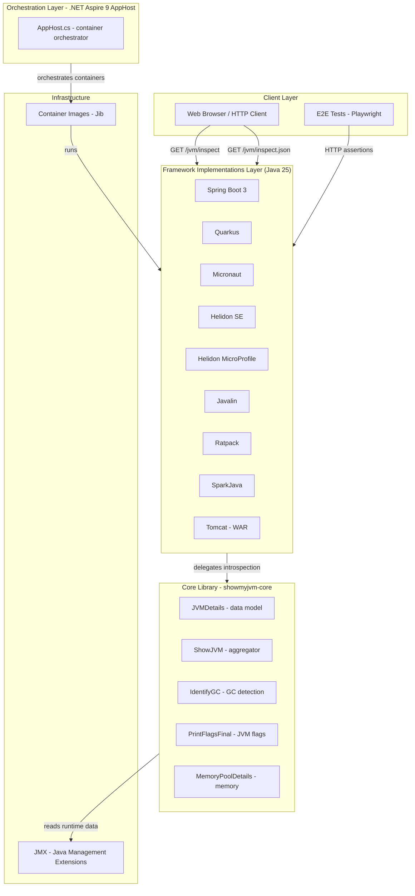
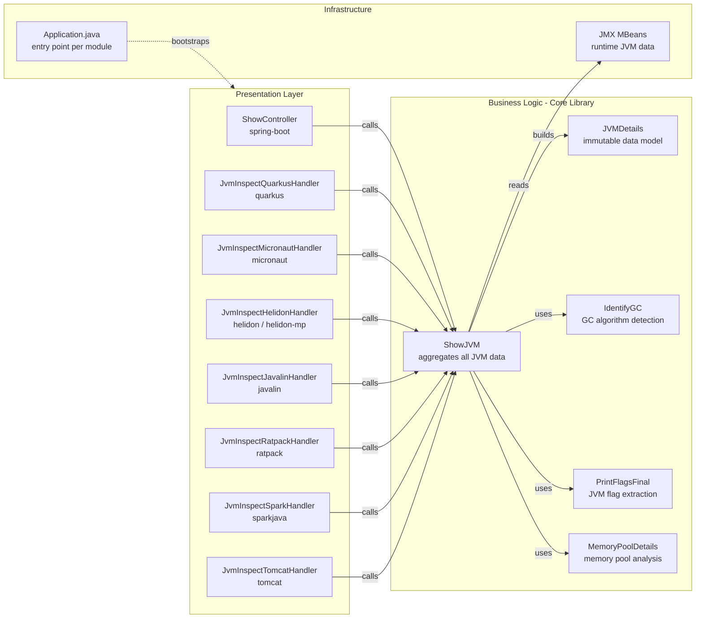

# Architecture Diagram

ShowMyJVM is a Maven multi-module Java project that demonstrates JVM introspection across nine web frameworks, plus a .NET Aspire orchestration host and an end-to-end test suite.

## Application Architecture

### Technology Stack Summary

| Layer | Technology | Version | Purpose |
|-------|-----------|---------|---------|
| Build / BOM | Maven + BOM | 3.9.1+ | Dependency management and multi-module build |
| Runtime | Java / OpenJDK | 25 | Application runtime for all Java modules |
| Core Library | Plain Java + JMX | 25 | JVM introspection (heap, GC, threads, flags) |
| Web Framework | Spring Boot | 3.x | REST endpoints (spring-boot module) |
| Web Framework | Quarkus | latest | REST endpoints (quarkus module) |
| Web Framework | Micronaut | latest | REST endpoints (micronaut module) |
| Web Framework | Helidon SE | latest | REST endpoints (helidon module) |
| Web Framework | Helidon MicroProfile | latest | REST endpoints (helidon-mp module) |
| Web Framework | Javalin | latest | REST endpoints (javalin module) |
| Web Framework | Ratpack | latest | REST endpoints (ratpack module) |
| Web Framework | SparkJava | latest | REST endpoints (sparkjava module) |
| Web Framework | Apache Tomcat | latest | Servlet-based WAR deployment (tomcat module) |
| Orchestration | .NET Aspire AppHost | 9.5.2 | Local container orchestration via Docker |
| Containerization | Jib | latest | Build OCI images without Dockerfile |
| E2E Testing | Playwright (Node.js) | latest | End-to-end API validation |

### Data Storage & External Services

ShowMyJVM has no persistent data store — it is a stateless read-only JVM diagnostic tool. All data is sourced at runtime from the JVM itself via JMX (Java Management Extensions) MBeans. There are no databases, caches, message brokers, or external API calls in the critical path. The .NET Aspire AppHost is used only for local development orchestration, pulling pre-built container images of each framework implementation.

### Key Architectural Decisions

- **Core library pattern**: All nine framework modules share a single `showmyjvm-core` library, ensuring identical introspection logic across frameworks with zero duplication.
- **BOM-driven versioning**: A dedicated `bom/` module centralises all dependency and plugin versions, so framework modules declare no version numbers directly.
- **Jib containerisation**: Container images are built without Dockerfiles using the Jib Maven plugin, simplifying CI/CD pipelines.

## Component Relationships

### Component Inventory

| Component | Layer | Type | Responsibility |
|-----------|-------|------|----------------|
| ShowController | Presentation | Spring MVC Controller | Maps `/jvm/inspect` and `/jvm/inspect.json` for Spring Boot |
| JvmInspect*Handler | Presentation | Framework Handler/Resource | Maps endpoints for each of the 8 other frameworks |
| Application.java | Infrastructure | Entry Point | Bootstraps the framework-specific HTTP server |
| ShowJVM | Business Logic | Aggregator / Facade | Collects all JVM runtime data via JMX and returns a JVMDetails DTO |
| JVMDetails | Business Logic | Data Model / DTO | Holds all introspected JVM fields (memory, GC, threads, flags, OS) |
| IdentifyGC | Business Logic | Utility | Detects the active GC algorithm (G1, ZGC, Shenandoah, etc.) |
| PrintFlagsFinal | Business Logic | Utility | Parses `XX:+PrintFlagsFinal` output to expose JVM flag values |
| MemoryPoolDetails | Business Logic | Data Model | Represents a single JVM memory pool with usage statistics |
| JMX MBeans | Infrastructure | Runtime API | Provides live JVM management data (MemoryMXBean, ThreadMXBean, etc.) |
