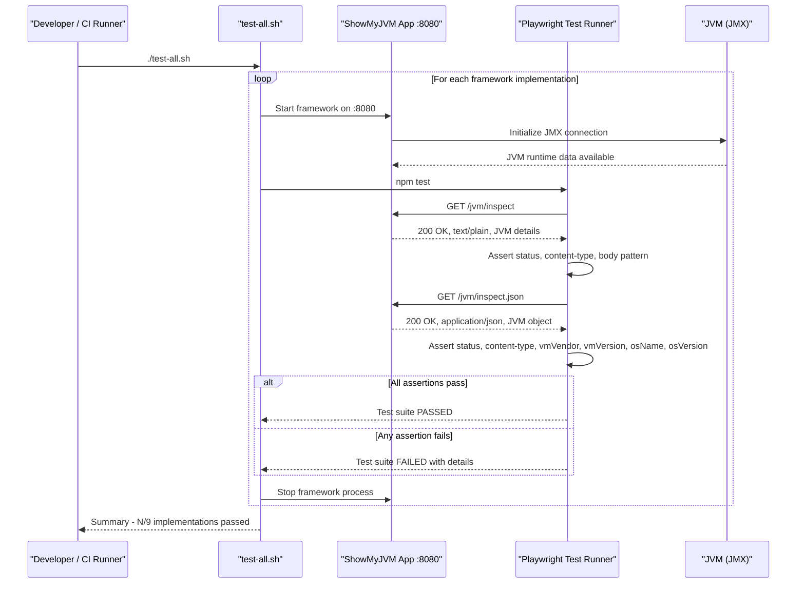

# Core Business Workflows

The `showmyjvm-e2e-tests` project's domain is **automated quality validation** — it verifies that every ShowMyJVM framework implementation correctly exposes JVM introspection data through standardized HTTP endpoints.

## Domain Entities

| Entity | Service / Bounded Context | Description | Key Relationships |
|---|---|---|---|
| JVM Inspect Response (text) | ShowMyJVM App (under test) | Plain-text JVM runtime details returned by `/jvm/inspect` | Input to text-format assertions |
| JVM Inspect Response (JSON) | ShowMyJVM App (under test) | Structured JSON JVM details returned by `/jvm/inspect.json` | Input to JSON structure assertions |
| Test Result | Playwright Test Runner | Pass/fail outcome for each individual test case | Aggregated into HTML report |
| Framework Implementation | CI / Test Orchestration | A named ShowMyJVM framework (Spring Boot, Quarkus, etc.) running on port 8080 | Subject of each test run |

## Service-to-Domain Mapping

| Service | Domain Context | Owned Entities | External Dependencies |
|---|---|---|---|
| Playwright Test Runner | Test Execution | Test Results, Test Assertions | ShowMyJVM App on localhost:8080 |
| ShowMyJVM App (under test) | JVM Introspection | JVM Inspect Response (text + JSON) | Java runtime via JMX |

## Primary Workflows

### Workflow 1: Validate Plain-Text JVM Endpoint

The test runner issues a `GET /jvm/inspect` request to the running framework application and asserts:

1. HTTP response status is `200 OK`.
2. `Content-Type` header contains `text/plain`.
3. Response body is non-empty.
4. Response body matches the pattern `/java|jvm|version/i` (case-insensitive), confirming JVM-related content is present.

If any assertion fails, the test is marked as failed and Playwright records a trace (on first retry).

### Workflow 2: Validate JSON JVM Endpoint

The test runner issues a `GET /jvm/inspect.json` request and asserts:

1. HTTP response status is `200 OK`.
2. `Content-Type` header contains `application/json`.
3. Response body deserializes to a JavaScript object.
4. The object contains properties `vmVendor`, `vmVersion`, `osName`, and `osVersion`.

If any assertion fails, the test is marked as failed.

### Workflow 3: Full Framework Matrix Validation (test-all.sh)

When running the full matrix via `test-all.sh`:

1. For each of the nine framework implementations:
   a. Start the framework application on port 8080.
   b. Wait for the process to become ready.
   c. Execute Workflows 1 and 2 above.
   d. Stop the framework application.
2. Collect per-framework pass/fail results.
3. Print a summary of which implementations passed and which failed.

## Cross-Service Data Flows

The test project has no internal service-to-service data flows. The single data flow is:

```
Test Runner → HTTP GET → ShowMyJVM App → JMX introspection → JVM runtime
                         ↓
                  HTTP response (text/JSON)
                         ↓
              Playwright assertion evaluation
                         ↓
                    Test Result (pass/fail)
```

There are no circuit-breaker fallbacks, gateway aggregation, or cross-service joins. If the target application is unavailable, the test fails immediately with a connection-refused error — there is no degraded-mode behavior.

## Business Workflow Sequence



## Business Rules & Decision Logic

**Validation Rules:**

- `/jvm/inspect` must return HTTP 200 — any non-2xx status is a failure.
- `/jvm/inspect` must return `Content-Type: text/plain` — missing or wrong content type is a failure.
- `/jvm/inspect` body must be non-empty and match `/java|jvm|version/i`.
- `/jvm/inspect.json` must return HTTP 200.
- `/jvm/inspect.json` must return `Content-Type: application/json`.
- `/jvm/inspect.json` body must be a valid JSON object (not a string, array, or null).
- `/jvm/inspect.json` JSON object must contain `vmVendor`, `vmVersion`, `osName`, and `osVersion` as top-level properties.

**Decision Logic:**

- In CI mode (`CI=true`): up to 2 retries per failing test; workers serialized to 1; `forbidOnly` prevents `test.only` calls from masking failures.
- In local mode: no retries; full parallelism; `test.only` is permitted.

**Error Handling:**

- Playwright captures a trace on the first retry (`trace: 'on-first-retry'`), giving developers a full request/response recording for diagnosis.
- No compensating actions or dead-letter handling — tests either pass or fail.

**Authorization:**

- No authorization rules. All tested endpoints are publicly accessible with no authentication required.
