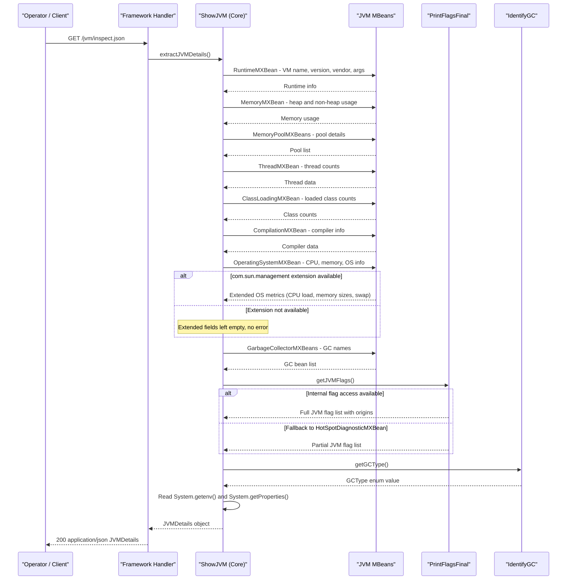

# Core Business Workflows

ShowMyJVM is a JVM introspection tool that allows developers and operators to inspect the runtime characteristics of a running JVM instance via HTTP — there is no user-facing business domain, persistent state, or multi-step transactional workflow.

## Domain Entities

ShowMyJVM has no persistent domain entities. Its data model consists of in-memory value objects populated from JVM MBeans at request time and discarded after the response is sent.

| Entity | Service / Bounded Context | Description | Key Relationships |
|--------|--------------------------|-------------|------------------|
| JVMDetails | Core introspection | Aggregate snapshot of the current JVM state including runtime, memory, threads, GC, OS, flags | Contains list of MemoryPoolDetails and JVMFlags |
| MemoryPoolDetails | Core introspection | Snapshot of a single JVM memory pool (heap or non-heap region) | Owned by JVMDetails |
| JVMFlag | Core introspection | A single JVM flag name, value, and its origin (default, command line, etc.) | Owned by JVMDetails |
| GCType | Core introspection | Enumeration of detected garbage collector algorithm (G1GC, ZGC, Shenandoah, etc.) | Referenced by JVMDetails |

## Service-to-Domain Mapping

All nine framework modules share the same bounded context — JVM Introspection — and delegate entirely to the `showmyjvm-core` library. There is no microservice decomposition or cross-service data flow.

| Service | Domain Context | Owned Entities | External Dependencies |
|---------|---------------|---------------|----------------------|
| showmyjvm-core | JVM Introspection | JVMDetails, MemoryPoolDetails, JVMFlag, GCType | JVM JMX MBeans (in-process) |
| showmyjvm-springboot | JVM Introspection (delegate) | None | showmyjvm-core |
| showmyjvm-quarkus | JVM Introspection (delegate) | None | showmyjvm-core |
| showmyjvm-micronaut | JVM Introspection (delegate) | None | showmyjvm-core |
| showmyjvm-helidon | JVM Introspection (delegate) | None | showmyjvm-core |
| showmyjvm-helidon-mp | JVM Introspection (delegate) | None | showmyjvm-core |
| showmyjvm-javalin | JVM Introspection (delegate) | None | showmyjvm-core |
| showmyjvm-ratpack | JVM Introspection (delegate) | None | showmyjvm-core |
| showmyjvm-sparkjava | JVM Introspection (delegate) | None | showmyjvm-core |
| showmyjvm-tomcat | JVM Introspection (delegate) | None | showmyjvm-core |

## Primary Workflows

### Workflow 1: JVM Inspection (Plain Text)

An operator or monitoring tool sends a GET request to `/jvm/inspect`. The framework handler delegates to `ShowJVM.dumpJVMDetails()`, which reads all JVM MBeans sequentially and produces a formatted multi-section plain-text report. The response is returned immediately with `Content-Type: text/plain`. No state is created, stored, or modified.

**Steps:**
1. Client sends `GET /jvm/inspect`
2. Framework routes request to handler/controller
3. Handler calls `new ShowJVM().dumpJVMDetails()`
4. `ShowJVM` reads `RuntimeMXBean` → appends runtime section
5. `ShowJVM` reads `MemoryMXBean` + `Runtime` → appends memory section
6. `ShowJVM` reads `ClassLoadingMXBean` → appends loaded classes section
7. `ShowJVM` reads `CompilationMXBean` → appends compiler section
8. `ShowJVM` reads `GarbageCollectorMXBeans` + `IdentifyGC` → appends GC section
9. `ShowJVM` reads `OperatingSystemMXBean` (including `com.sun.management` extension via reflection) → appends CPU/OS section
10. `ShowJVM` reads `ThreadMXBean` → appends threads section
11. `ShowJVM` reads `System.getProperties()` → appends system properties section
12. `ShowJVM` reads `System.getenv()` → appends environment variables section
13. `ShowJVM` reads `PrintFlagsFinal.getJVMFlags()` → appends JVM flags section
14. Handler returns assembled string as `text/plain` response

### Workflow 2: JVM Inspection (JSON)

An operator or monitoring tool sends a GET request to `/jvm/inspect.json`. The framework handler delegates to `ShowJVM.extractJVMDetails()`, which reads all JVM MBeans and populates a `JVMDetails` POJO. The framework's JSON serializer (Jackson, Yasson, or Micronaut Jackson Databind) converts the POJO to JSON and returns it as `application/json`. No state is created, stored, or modified.

**Steps:**
1. Client sends `GET /jvm/inspect.json`
2. Framework routes request to handler/controller
3. Handler calls `new ShowJVM().extractJVMDetails()`
4. `ShowJVM` populates a `JVMDetails` object using all JMX MBeans (same sources as Workflow 1)
5. For extended OS metrics, `ShowJVM` uses reflection to access `com.sun.management.OperatingSystemMXBean`; if unavailable, extended fields are skipped silently
6. `PrintFlagsFinal` retrieves JVM flags — first attempts `com.sun.management.internal.Flag.getAllFlags()` via reflection; falls back to `HotSpotDiagnosticMXBean.getVMOptionNames()` if the primary path is inaccessible
7. `IdentifyGC` determines the GC type by inspecting JVM flags
8. Handler returns the populated `JVMDetails` object; framework serializes it to JSON
9. Response is returned as `application/json`

## Cross-Service Data Flows

ShowMyJVM has no cross-service data flows. All data originates from the JVM process itself via in-process JMX MBean calls. The nine framework modules are alternative implementations of the same standalone service — they are never deployed together or composed.

The only "aggregation" occurs within `ShowJVM`, which combines data from multiple MBeans (`RuntimeMXBean`, `MemoryMXBean`, `GarbageCollectorMXBean`, `ThreadMXBean`, `OperatingSystemMXBean`, `ClassLoadingMXBean`, `CompilationMXBean`) into a single response object.

## Business Workflow Sequence

## Business Rules & Decision Logic

### Validation Rules

There are no user input validation rules. All inputs are zero — the endpoints accept no request body or query parameters. The only "input" is the HTTP path, and unknown paths result in a framework-default 404 response (or, in the Tomcat module, an explicit `SC_NOT_FOUND` response).

### Decision Logic

| Decision Point | Logic | Outcome |
|---------------|-------|---------|
| Extended OS metrics availability | Checks if `com.sun.management.OperatingSystemMXBean` is accessible via reflection | If available: populates CPU load, memory, swap fields. If not: fields remain at default (0 or null) |
| JVM flag retrieval strategy | Attempts `com.sun.management.internal.Flag.getAllFlags()` first | Falls back to `HotSpotDiagnosticMXBean.getVMOptionNames()` if primary path throws an exception |
| GC type identification | `IdentifyGC` checks JVM flags (e.g., UseG1GC, UseZGC, UseShenandoahGC) | Returns one of: G1GC, ZGC, ShenandoahGC, ConcMarkSweepGC, ParallelGC, SerialGC, Unknown |
| Port selection | Each module checks `System.getenv("PORT")` at startup | If set: uses `Integer.parseInt(PORT)`. If not set: defaults to 8080 |
| Content type routing (Tomcat) | `ShowMyJVMServlet` switches on `req.getPathInfo()` | `/inspect` → text/plain, `/inspect.json` → JSON, other → 404 with error message |

### State Transitions

No entity state transitions exist. All processing is stateless and request-scoped.

### Cross-Cutting Concerns

| Concern | Implementation |
|---------|---------------|
| Transactions | None — no persistence layer |
| Error handling | Reflection errors in OS/flag access are silently swallowed; servlet errors wrapped in `ServletException`; other frameworks use default error handling |
| Logging | SLF4J used in `IdentifyGC` and `PrintFlagsFinal` for WARN-level diagnostics when reflection-based access fails |
| Authorization | None — all endpoints are publicly accessible |
| Audit/tracing | None |
