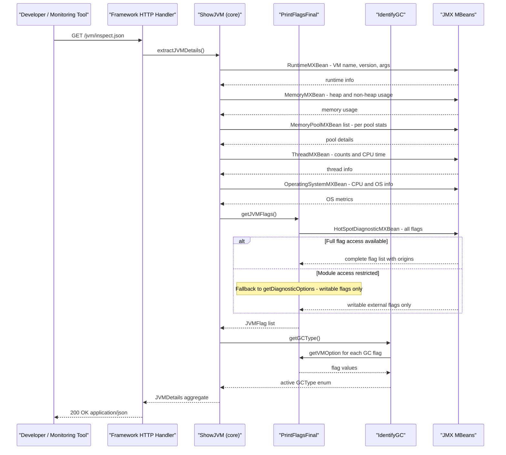

# Core Business Workflows

ShowMyJVM is a JVM diagnostic tool that lets developers and operators inspect the runtime state of any running Java process by requesting a plain-text or JSON snapshot of JVM internals via HTTP.

## Domain Entities

| Entity | Service / Bounded Context | Description | Key Relationships |
|--------|--------------------------|-------------|------------------|
| JVMDetails | JVM Inspection (showmyjvm-core) | Aggregate root: a complete point-in-time snapshot of the running JVM | Contains a list of MemoryPoolDetails and a list of JVMFlag |
| MemoryPoolDetails | JVM Inspection (showmyjvm-core) | Represents one JVM memory pool (heap/non-heap region) with current, peak, and collection usage | Owned by JVMDetails |
| JVMFlag | JVM Inspection (showmyjvm-core) | A single JVM tuning flag with its name, value, origin, and mutability | Owned by JVMDetails |
| GCType (enum) | JVM Inspection (showmyjvm-core) | Classification of the active garbage collector algorithm (G1GC, ZGC, ShenandoahGC, etc.) | Referenced by JVMDetails |

## Service-to-Domain Mapping

| Service | Domain Context | Owned Entities | External Dependencies |
|---------|---------------|---------------|----------------------|
| showmyjvm-core | JVM Inspection | JVMDetails, MemoryPoolDetails, JVMFlag, GCType | JMX platform MBeans (in-process) |
| showmyjvm-spring-boot | JVM Inspection (Spring adapter) | None — delegates to core | showmyjvm-core |
| showmyjvm-quarkus | JVM Inspection (Quarkus adapter) | None — delegates to core | showmyjvm-core |
| showmyjvm-micronaut | JVM Inspection (Micronaut adapter) | None — delegates to core | showmyjvm-core |
| showmyjvm-helidon | JVM Inspection (Helidon SE adapter) | None — delegates to core | showmyjvm-core |
| showmyjvm-helidon-mp | JVM Inspection (Helidon MP adapter) | None — delegates to core | showmyjvm-core |
| showmyjvm-javalin | JVM Inspection (Javalin adapter) | None — delegates to core | showmyjvm-core |
| showmyjvm-ratpack | JVM Inspection (Ratpack adapter) | None — delegates to core | showmyjvm-core |
| showmyjvm-sparkjava | JVM Inspection (SparkJava adapter) | None — delegates to core | showmyjvm-core |
| showmyjvm-tomcat | JVM Inspection (Servlet adapter) | None — delegates to core | showmyjvm-core |

All nine framework services participate in the same bounded context. There is no cross-service communication — each deployment is an independent, self-contained JVM diagnostic endpoint.

## Primary Workflows

### Workflow 1: JVM Plain-Text Inspection

A developer or operator sends `GET /jvm/inspect` to one of the running services. The framework handler calls `ShowJVM.dumpJVMDetails()`, which queries JMX MBeans synchronously and assembles a multi-section formatted text report covering: Runtime Properties, Memory Settings, Loaded Classes, Compiler stats, Garbage Collectors, CPU usage, Thread details, System Properties, Environment Variables, and JVM Final Flags. The completed string is returned as `text/plain` with HTTP 200.

Steps:
1. HTTP GET arrives at `/jvm/inspect`
2. Framework routes request to text handler
3. `ShowJVM.dumpJVMDetails()` collects data from 7+ JMX MBeans in sequence
4. `PrintFlagsFinal` reads JVM flags via `HotSpotDiagnosticMXBean` (with reflection fallback for Java module restrictions)
5. `IdentifyGC` checks GC flags to classify the garbage collector
6. Formatted text report assembled and returned

### Workflow 2: JVM JSON Inspection

A developer or monitoring tool sends `GET /jvm/inspect.json` to receive a structured JSON object. The handler calls `ShowJVM.extractJVMDetails()`, which populates a `JVMDetails` aggregate from the same JMX sources and returns it. The framework serializes the object to JSON using its native serializer (Jackson, JSON-B, or Helidon's media support). Response is `application/json` with HTTP 200.

Steps:
1. HTTP GET arrives at `/jvm/inspect.json`
2. Framework routes request to JSON handler
3. `ShowJVM.extractJVMDetails()` builds a `JVMDetails` aggregate:
   - Reads `RuntimeMXBean`, `ClassLoadingMXBean`, `CompilationMXBean`, `MemoryMXBean`, `MemoryPoolMXBean` list, `ThreadMXBean`, `OperatingSystemMXBean`
   - Attempts extended OS metrics via `com.sun.management.OperatingSystemMXBean` reflection (CPU load, memory, swap); silently ignored if unavailable
   - Calls `PrintFlagsFinal.getJVMFlags()` for all JVM flags
   - Calls `IdentifyGC.getGCType()` to classify the GC algorithm
   - Collects all environment variables and system properties
4. `JVMDetails` object returned to framework handler
5. Framework serializes to JSON and sends HTTP 200 response

### Workflow 3: Unknown Path Handling (Tomcat only)

For the Tomcat servlet implementation, any request to `/jvm/*` that is not `/inspect` or `/inspect.json` is explicitly handled with a `404 Not Found` response and a `text/plain` error body. Other framework implementations delegate 404 handling to the framework's default error mechanism.

## Cross-Service Data Flows

ShowMyJVM has no cross-service data flows. Each of the nine service deployments is fully self-contained: it reads data from the JVM it is running inside, and returns it directly to the caller. There is no inter-service HTTP calls, no message bus, no shared database, and no gateway aggregation.

The only meaningful "data flow" is intra-process:
- The JMX subsystem (`ManagementFactory`) is the data source
- `ShowJVM` is the aggregation point that collects from multiple MBeans and assembles the `JVMDetails` DTO
- The framework handler is the delivery mechanism

There are no fallback paths because there are no downstream services that could be unavailable.

## Business Workflow Sequence

## Business Rules & Decision Logic

**GC Identification rule**: `IdentifyGC` checks each known GC flag (`UseG1GC`, `UseZGC`, `UseShenandoahGC`, `UseConcMarkSweepGC`, `UseParallelGC`, `UseSerialGC`) in order, looking for the first whose flag value is `"true"`. If none matches, the result is `GCType.Unknown`. This identifies which garbage collection algorithm is active in the running JVM.

**JVM flag access degradation**: `PrintFlagsFinal` first attempts to read all JVM flags using the internal `com.sun.management.internal.Flag.getAllFlags()` API (which requires `--add-opens`). If this is blocked by Java module encapsulation (`InaccessibleObjectException`), it falls back to `HotSpotDiagnosticMXBean.getDiagnosticOptions()`, which returns only externally writable flags. If `HotSpotDiagnosticMXBean` is also unavailable, no flags are returned.

**Extended OS metrics degradation**: `ShowJVM` attempts to cast `OperatingSystemMXBean` to `com.sun.management.OperatingSystemMXBean` via reflection to access CPU load, process CPU time, and detailed memory metrics. If the cast fails or the methods throw, these fields are silently omitted from `JVMDetails` — no error is surfaced to the caller.

**Routing decision (Tomcat)**: `ShowMyJVMServlet` uses a `switch` on `req.getPathInfo()`: `/inspect` → plain-text handler, `/inspect.json` → JSON handler, anything else → 404 error handler.

**No state transitions**: The application is entirely stateless and read-only. There are no entity lifecycle states, no workflow stages, and no mutations.

**No transaction management**: No `@Transactional` annotations or transaction scopes exist; there is no data to persist.

**No authorization**: All endpoints are publicly accessible. No role checks, `@PreAuthorize`, or authentication filters are applied. Access control is the responsibility of the deployment environment.

**Error handling**: JVM introspection errors propagate as `RuntimeException` and are caught by the framework's default error handler, resulting in an HTTP 500 response. The Tomcat servlet explicitly wraps exceptions in `ServletException`. No compensating actions or dead-letter queues exist.

**Sensitive data exposure rule**: The `extractJVMDetails()` method includes all environment variables and all system properties verbatim in the `JVMDetails` response. There is no filtering, masking, or exclusion list — any secrets present in the process environment will be included in the JSON response.
