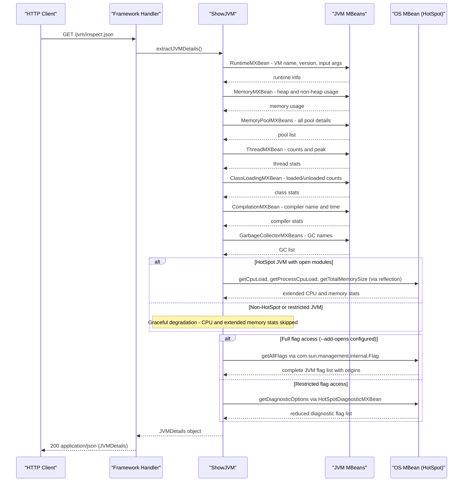

# Core Business Workflows

ShowMyJVM is a developer diagnostic tool that captures and exposes a comprehensive snapshot of the running JVM's internal state on demand, enabling developers and operators to inspect memory, CPU, threads, GC, and configuration in real time.

## Domain Entities

| Entity | Service / Bounded Context | Description | Key Relationships |
|--------|--------------------------|-------------|-------------------|
| JVMDetails | Core — JVM Introspection | The primary response object; an aggregate snapshot of all live JVM metrics collected at request time | Contains a list of MemoryPoolDetails and JVMFlags; references GCType |
| MemoryPoolDetails | Core — JVM Introspection | Represents a single JVM memory pool (e.g., Metaspace, Eden Space, Old Gen) with usage and peak-usage snapshots | Owned by JVMDetails (composition) |
| JVMFlag | Core — JVM Introspection | Represents a single JVM flag with its name, value, and origin (default / command-line / ergonomic / management) | Owned by JVMDetails (composition) |
| GCType | Core — JVM Introspection | Identifies the active garbage collector algorithm (G1GC, ZGC, Shenandoah, Serial, Parallel, CMS, Unknown) | Referenced by JVMDetails |

## Service-to-Domain Mapping

| Service | Domain Context | Owned Entities | External Dependencies |
|---------|---------------|----------------|----------------------|
| showmyjvm-core | JVM Introspection | JVMDetails, MemoryPoolDetails, JVMFlag, GCType | JDK JMX MBeans (internal — same JVM) |
| All framework modules (×9) | HTTP Delivery | None (delegate entirely to core) | showmyjvm-core library |

All nine framework modules share the same bounded context: they are HTTP delivery adapters for the JVM Introspection domain. The `core` module is the sole source of truth for all domain logic.

## Primary Workflows

### Workflow 1: JVM Inspection (Text)

A client requests a human-readable, formatted snapshot of the running JVM. This is the primary diagnostic workflow.

**Steps:**
1. Client issues `GET /jvm/inspect` to the framework's HTTP server.
2. The framework handler delegates to `ShowJVM.dumpJVMDetails()`.
3. `ShowJVM` queries each JMX MBean category in sequence:
   - Runtime properties (VM name, version, vendor, PID, input arguments)
   - Memory settings (heap used/free/total/max via `Runtime.getRuntime()`)
   - Loaded classes (total, unloaded, currently loaded via `ClassLoadingMXBean`)
   - Compilation stats (compiler name, total compilation time via `CompilationMXBean`)
   - Garbage collectors (names, object names, identified GC type via `GarbageCollectorMXBeans` + `IdentifyGC`)
   - CPU usage (load average, processors, virtual/physical/swap memory via `OperatingSystemMXBean` + HotSpot-specific MBean via reflection)
   - Thread details (count, peak, total started, all thread dumps via `ThreadMXBean`)
   - System properties (all JVM system properties)
   - Environment variables (all OS environment variables)
   - JVM flags (all flags with origins via `PrintFlagsFinal` → `HotSpotDiagnosticMXBean`)
4. All sections are appended to a `StringBuilder` and returned as a `text/plain` response.

**Business Rules:**
- Data is always fresh — no caching or stale data.
- If the HotSpot-specific MBean is inaccessible (e.g., non-HotSpot JVM or missing `--add-opens`), CPU/memory details degrade gracefully; the remaining sections are still returned.
- If the internal JVM flag reflection fails (missing `--add-opens jdk.management/com.sun.management.internal`), `PrintFlagsFinal` falls back to `HotSpotDiagnosticMXBean.getDiagnosticOptions()` (a reduced flag set).

### Workflow 2: JVM Inspection (JSON)

A client requests a machine-readable JSON snapshot of the same JVM data, suitable for programmatic consumption or integration.

**Steps:**
1. Client issues `GET /jvm/inspect.json` to the framework's HTTP server.
2. The framework handler delegates to `ShowJVM.extractJVMDetails()`.
3. `ShowJVM` populates a `JVMDetails` POJO by querying the same JMX MBean categories as Workflow 1, but returns a structured object instead of a string.
4. The framework serializes `JVMDetails` to JSON (Jackson or JSON-B depending on the framework) and returns it as `application/json`.

**Business Rules:**
- Same resilience rules apply as Workflow 1.
- `JVMDetails` includes `systemProperties` and `environmentVariables` as flat string lists (`KEY=VALUE` format), exposing all runtime configuration including potentially sensitive values.
- JSON pretty-printing is enabled by default in the Spring Boot implementation (`spring.jackson.serialization.indent_output=true`).

## Cross-Service Data Flows

ShowMyJVM has no inter-service data flows. Each of the nine services operates entirely within its own JVM process, querying local JMX MBeans. There is no gateway aggregation, no cross-service calls, no shared data store, and no message passing.

The only "cross-boundary" data flow is internal to the JVM:

- **HTTP layer → Core library**: The framework handler calls `ShowJVM` methods.
- **Core library → JVM MBeans**: `ShowJVM` queries `ManagementFactory`-provided MBeans.
- **Core library → OS** (via JMX): Extended OS metrics are retrieved via `com.sun.management.OperatingSystemMXBean` using reflection to avoid compile-time module access restrictions.

If the HotSpot diagnostic MBean is unavailable (non-HotSpot JVM), the flag-extraction path falls back gracefully and returns a partial result.

## Business Workflow Sequence

## Business Rules & Decision Logic

**Data Collection Rules:**
- **Always-fresh data**: Every request triggers a complete re-query of all JMX MBeans. No memoization, caching, or periodic polling is performed. The response reflects the JVM state at the exact moment of the request.
- **Graceful degradation for HotSpot APIs**: Extended OS metrics (`committed virtual memory`, `total/free physical memory`, `swap space`, `system/process CPU load`, `process CPU time`) are accessed via `com.sun.management.OperatingSystemMXBean` through reflection. If this class is unavailable (non-HotSpot JVM), the exception is caught silently and the affected fields are omitted from the response without failing the request.
- **Graceful degradation for JVM flags**: `PrintFlagsFinal` first attempts to read all flags via `com.sun.management.internal.Flag.getAllFlags()` (requires `--add-opens`). If that fails with `InaccessibleObjectException` or `ClassNotFoundException`, it falls back to `HotSpotDiagnosticMXBean.getDiagnosticOptions()`, which returns a smaller subset of flags. If that also fails, an empty flag list is returned.
- **GC identification**: `IdentifyGC` determines the active GC algorithm by checking JVM flags (`UseG1GC`, `UseZGC`, `UseShenandoahGC`, etc.) using the flags already gathered by `PrintFlagsFinal`. If no recognized flag is found, `GCType.Unknown` is returned.

**Output Rules:**
- **Text format**: Sections are separated by blank lines and labeled with `## Section Name` headers. Data is formatted as `key: value` lines. Thread names are listed individually.
- **JSON format**: The `JVMDetails` POJO is serialized as-is; list fields (`systemProperties`, `environmentVariables`, `garbageCollectors`, `jvmFlags`, `memoryPoolMXBeans`) are JSON arrays. The Spring Boot implementation enables pretty-printing.
- **Environment variable exposure**: All environment variables are included in both text and JSON output without filtering. This is a deliberate design choice for a diagnostic tool but represents a security risk if deployed in environments where secrets are injected as environment variables.

**Transactions / State / Concurrency:**
- No transactions, no state mutations, no shared mutable state. The `ShowJVM` class is instantiated fresh per request (each handler calls `new ShowJVM()`), and the `StringBuilder` buffer is instance-scoped.
- No authorization checks are performed at any layer. All endpoints are publicly accessible.

**Error Handling:**
- JMX query failures are caught with try/catch blocks; partial results are returned rather than failing the entire request.
- The text-format output uses a reusable `StringBuilder` (`sb_reuse`) that is cleared after each line — no cross-request state contamination.
