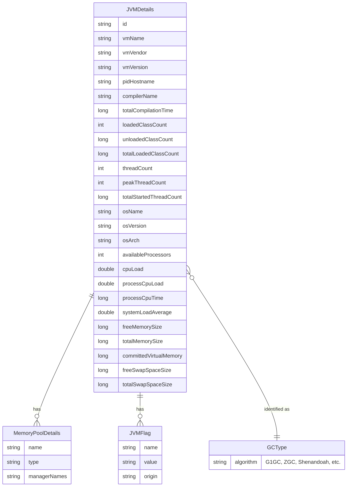

# Data Architecture & Persistence Layer

ShowMyJVM has no persistent data storage — it is a stateless, read-only JVM introspection tool whose sole "data model" consists of in-memory POJOs populated at request time from JMX MBeans.

## Database Configuration

| Service/Module | DB Type | Profile | Driver | Connection | Migration Tool |
|----------------|---------|---------|--------|------------|----------------|
| All modules | None | All | None | None | None |

No database is configured in any module. There are no JDBC URLs, connection pools, Flyway/Liquibase scripts, DDL auto-generation settings, or seed data files. All data is obtained transiently from the JVM at request time and discarded after the HTTP response is sent.

## Data Ownership per Service

| Service | Tables Owned | ORM Framework | Caching | Notes |
|---------|-------------|---------------|---------|-------|
| showmyjvm-core | None | None | None | Owns in-memory POJOs (JVMDetails, MemoryPoolDetails, JVMFlag, GCType) — no persistence |
| All framework modules | None | None | None | Delegate entirely to core; no independent data ownership |

## Entity Model

The project has no JPA entities, database tables, or ORM mappings. The diagram below shows the in-memory object model serialized as the JSON response — these are transient runtime value objects, not persisted entities.

## Key Repository Methods

No repository interfaces exist. The data access layer is provided entirely by the JDK's `java.lang.management` APIs:

| Component | Method | Source | Purpose |
|-----------|--------|--------|---------|
| ShowJVM | `extractJVMDetails()` | `core/src/main/java/.../ShowJVM.java` | Queries all JMX MBeans and populates a `JVMDetails` POJO |
| ShowJVM | `dumpJVMDetails()` | `core/src/main/java/.../ShowJVM.java` | Returns formatted plain-text representation of JVM state |
| IdentifyGC | `IdentifyGC(PrintFlagsFinal)` | `core/src/main/java/.../IdentifyGC.java` | Detects active GC algorithm from HotSpot diagnostic MBean |
| PrintFlagsFinal | `readJVMFlags()` | `core/src/main/java/.../PrintFlagsFinal.java` | Extracts all JVM flags with their origin (default/command-line/ergonomic) via `com.sun.management.HotSpotDiagnosticMXBean` |

## Caching Strategy

No caching layer is implemented. Every HTTP request triggers a fresh query of the JVM's JMX MBeans — results are never cached, memoized, or stored. This is intentional: the purpose of the tool is to reflect live JVM state at the moment of the request.

No `@Cacheable`, Redis, EhCache, Caffeine, or any other caching provider is declared in any module.

## Data Ownership Boundaries

All nine framework modules are fully independent processes that each own their own in-memory object graph for the duration of a single HTTP request. There is no shared data store, no cross-service data access, no CQRS split, and no read/write separation. Each service queries JMX locally and returns the result directly — the data lifecycle is entirely request-scoped.

### Data Classification & Sensitivity

| Object | Fields | Classification | Controls in Place |
|--------|--------|----------------|-------------------|
| JVMDetails | `systemProperties`, `environmentVariables` | Potentially sensitive | None — system properties and environment variables are returned in the JSON response verbatim; these may contain credentials, tokens, or configuration secrets depending on the deployment context |
| JVMDetails | All other fields (memory, CPU, threads, GC) | Internal/operational | None required |
| MemoryPoolDetails | Pool usage metrics | Internal/operational | None required |
| JVMFlag | JVM flag names and values | Internal/operational | JVM flags may expose tuning parameters but typically no secrets |

> **Note**: The most significant sensitivity concern is that `systemProperties` and `environmentVariables` are included in the `/jvm/inspect.json` response. In a production environment these fields could expose secrets injected via environment variables (e.g., database passwords, API keys). No masking, filtering, or access control is configured for these fields.
