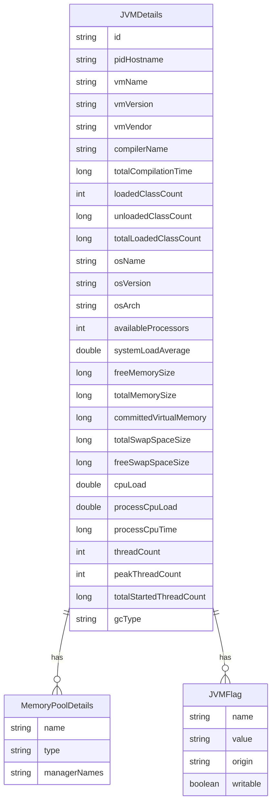

# Data Architecture & Persistence Layer

ShowMyJVM has no persistent data store — all data is sourced at runtime from the JVM via JMX MBeans and surfaced through four in-memory model classes in the `showmyjvm-core` library.

## Database Configuration

| Service/Module | DB Type | Profile | Driver | Connection | Migration Tool |
|---------------|---------|---------|--------|-----------|----------------|
| All modules | None | All | None | None | None |

ShowMyJVM contains no database, no JDBC datasource, no ORM, and no migration tool. All data is read-only and sourced live from the running JVM's JMX platform MBeans (`ManagementFactory`). There is nothing to configure, migrate, or persist.

## Data Ownership per Service

| Service | Data Owned | Data Source | ORM Framework | Caching | Notes |
|---------|-----------|------------|--------------|---------|-------|
| showmyjvm-core | JVMDetails, MemoryPoolDetails, JVMFlag, GCType | JMX MBeans (in-process) | None | None | Read-only; data is re-collected on every HTTP request |
| All framework modules | None | Delegates entirely to showmyjvm-core | None | None | No local data ownership |

## Entity Model

> Note: ShowMyJVM has no relational database entities, JPA annotations, or ORM mappings. The diagram below documents the in-memory runtime model classes in `showmyjvm-core` that are serialized as the API response.

All fields are populated in `ShowJVM.extractJVMDetails()` by querying JMX MBeans; none are persisted. `MemoryUsage` (heap and non-heap usage from `MemoryMXBean`) and the list of garbage collector names are also part of `JVMDetails` but are represented as nested objects from the standard Java management API.

## Key Repository Methods

There are no repository interfaces, DAO classes, or data access objects in this project. Data retrieval is performed directly in `ShowJVM` by calling standard `java.lang.management.ManagementFactory` APIs:

| Class | Method | JMX Source | Purpose |
|-------|--------|-----------|---------|
| ShowJVM | `extractJVMDetails()` | Multiple MBeans | Builds and returns the complete `JVMDetails` DTO |
| ShowJVM | `dumpJVMDetails()` | Multiple MBeans | Returns a formatted plain-text dump of JVM state |
| PrintFlagsFinal | `getJVMFlags()` | `HotSpotDiagnosticMXBean` | Returns all JVM flags with values and origins |
| PrintFlagsFinal | `getVMOption(name)` | `HotSpotDiagnosticMXBean` | Returns the value of a single named JVM flag |
| IdentifyGC | `getGCType()` | `HotSpotDiagnosticMXBean` / PrintFlagsFinal | Detects the active GC algorithm by checking GC flags |

JMX MBeans accessed per request:
- `RuntimeMXBean` — VM name, version, vendor, input arguments
- `ClassLoadingMXBean` — loaded/unloaded class counts
- `CompilationMXBean` — JIT compiler name and total compilation time
- `MemoryMXBean` — heap and non-heap usage
- `MemoryPoolMXBean` (list) — per-pool usage, peak, and collection usage
- `ThreadMXBean` — thread count, peak, CPU time
- `OperatingSystemMXBean` / `com.sun.management.OperatingSystemMXBean` (via reflection) — CPU load, memory, swap
- `HotSpotDiagnosticMXBean` — JVM flags and GC type

## Caching Strategy

No caching layer is present. `ShowJVM` is instantiated on every HTTP request and collects fresh data from JMX MBeans at call time. There are no `@Cacheable` annotations, no second-level cache, no Redis or EhCache configuration, and no session-scoped caching in any framework module.

This is intentional: the tool's purpose is to report the _current_ live state of the JVM, so stale cached values would defeat its purpose.

## Data Ownership Boundaries

All nine framework services share a single in-process data source: the JVM's own JMX subsystem. There is no external database, no shared schema, and no cross-service data access. Each deployment is fully isolated — a Tomcat container and a Spring Boot container running on the same host report their own JVM metrics independently.

There are no shared-database anti-patterns to resolve; data store isolation is structurally guaranteed because there is no data store at all.

### Data Classification & Sensitivity

| Class | Fields of Note | Classification | Controls in Place |
|-------|---------------|----------------|------------------|
| JVMDetails | `environmentVariables` (all OS env vars), `systemProperties` (all JVM system props) | Potentially sensitive — env vars may contain secrets (API keys, passwords, connection strings) | None — all values are returned verbatim in the API response |
| JVMDetails | `pidHostname` (process ID and hostname) | Internal infrastructure info | None |
| JVMDetails | All other fields (memory, CPU, GC, thread counts) | Non-sensitive operational metrics | None required |

**Risk**: The `/jvm/inspect.json` endpoint returns the complete set of environment variables and system properties of the running JVM process. If the process was started with sensitive values in environment variables (e.g., `DATABASE_PASSWORD`, `AWS_SECRET_ACCESS_KEY`), those values are exposed in the API response without any masking or filtering. No field-level redaction, encryption-at-rest, or access control is implemented.
