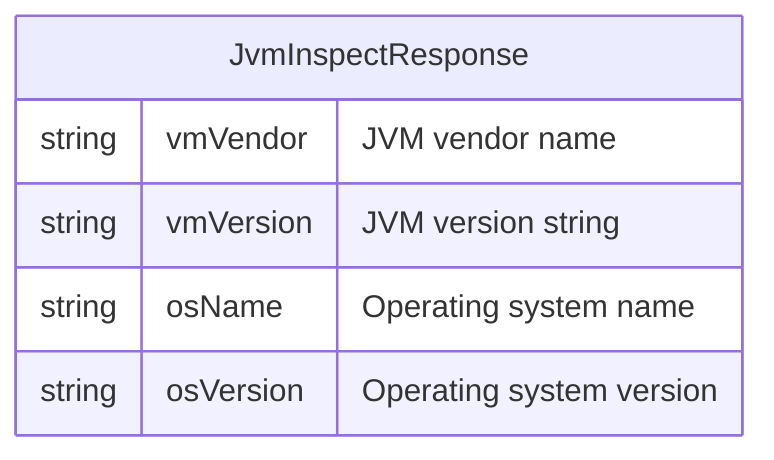

# Data Architecture & Persistence Layer

The `showmyjvm-e2e-tests` project is a stateless HTTP test client with **no data access layer, no entities, no database, and no persistence**. All data interactions happen exclusively through HTTP assertions against the running ShowMyJVM framework applications.

## Database Configuration

| Service/Module | DB Type | Profile | Driver | Connection | Migration Tool |
|---|---|---|---|---|---|
| showmyjvm-e2e-tests | None | N/A | None | None | None |

> This project contains no database configuration. It is a pure Playwright/TypeScript test suite that issues HTTP requests and validates responses. For database configuration of the tested applications, refer to the individual framework modules in the parent repository.

## Data Ownership per Service

| Service | Tables Owned | ORM Framework | Caching | Notes |
|---|---|---|---|---|
| showmyjvm-e2e-tests | None | None | None | Stateless test client only; no data storage |

## Entity Model

> No entities are defined in this project. The data model is implicit in the JSON response contract validated by the tests. The expected JSON fields (`vmVendor`, `vmVersion`, `osName`, `osVersion`) are defined by `JVMDetails.java` in the `core` module of the parent repository.

> Note: `JvmInspectResponse` is not a defined class in this project — it represents the implicit JSON contract asserted by the E2E tests. The actual class is `JVMDetails` in the `core` module.

## Key Repository Methods

| Service | Repository | Notable Methods | Purpose |
|---|---|---|---|
| showmyjvm-e2e-tests | None | N/A | No repositories exist in this project |

## Caching Strategy

No caching layer is used or configured in this project. The test suite issues fresh HTTP requests for each test run. Playwright does not cache HTTP responses between tests; each `request.get(...)` call is a new network request.

## Data Ownership Boundaries

This project owns no data stores and has no data boundaries to document. It is a read-only consumer of HTTP endpoints:

- The test suite reads from `http://localhost:8080/jvm/inspect` and `http://localhost:8080/jvm/inspect.json`.
- It does not write, update, or delete any data.
- All data production (JVM introspection via JMX) happens inside the framework application under test.

### Data Classification & Sensitivity

No PII, PHI, or PCI data is stored, transmitted, or processed by this test project. The HTTP responses it validates contain JVM runtime metadata (vendor, version, OS name, OS version) — no personally identifiable or sensitive information.

| Entity | Sensitive Fields | Classification | Controls in Place |
|---|---|---|---|
| JvmInspectResponse (implicit) | None | None | N/A |
