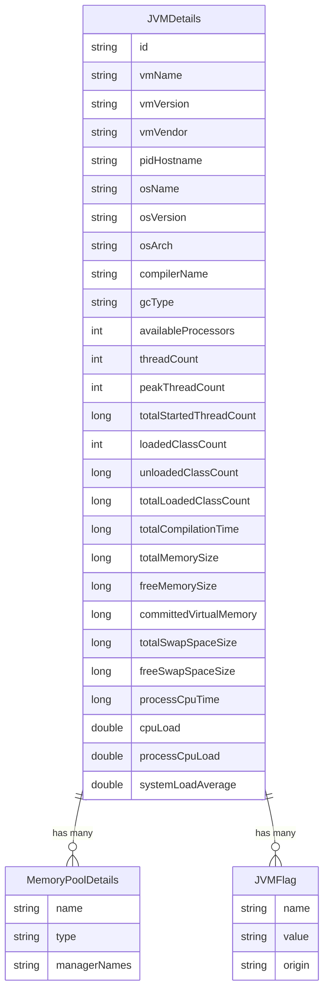

# Data Architecture & Persistence Layer

ShowMyJVM has no persistent data storage layer. All data is sourced at runtime from the JVM itself via JMX MBeans, system properties, and environment variables, and is returned directly to the HTTP client without any storage or caching.

## Database Configuration

No database is used in this application. There are no JDBC drivers, ORM frameworks, migration tools, or connection pool configurations in any module.

| Service/Module | DB Type | Profile | Driver | Connection | Migration Tool |
|----------------|---------|---------|--------|-----------|---------------|
| All modules | None | N/A | None | N/A | None |

## Data Ownership per Service

All nine framework modules share the same `showmyjvm-core` library, which owns the `JVMDetails`, `MemoryPoolDetails`, `IdentifyGC`, and `PrintFlagsFinal` in-memory data models. No module persists or stores data.

| Service | Tables Owned | ORM Framework | Caching | Notes |
|---------|-------------|--------------|---------|-------|
| showmyjvm-core | None (in-memory only) | None | None | Owns JVMDetails POJO and supporting model classes |
| showmyjvm-springboot | None | None | None | Delegates entirely to core library |
| showmyjvm-quarkus | None | None | None | Delegates entirely to core library |
| showmyjvm-micronaut | None | None | None | Delegates entirely to core library |
| showmyjvm-helidon | None | None | None | Delegates entirely to core library |
| showmyjvm-helidon-mp | None | None | None | Delegates entirely to core library |
| showmyjvm-javalin | None | None | None | Delegates entirely to core library |
| showmyjvm-ratpack | None | None | None | Delegates entirely to core library |
| showmyjvm-sparkjava | None | None | None | Delegates entirely to core library |
| showmyjvm-tomcat | None | None | None | Delegates entirely to core library |

## Entity Model

The application's in-memory data model consists of four classes in the `core` module. These are not JPA entities — they are plain Java objects populated from JMX at request time and serialized to JSON or plain text.

> Note: `heapMemoryUsage`, `nonHeapMemoryUsage`, `inputArguments`, `garbageCollectors`, `systemProperties`, and `environmentVariables` are collection/complex fields on `JVMDetails` — they are not shown as separate entities as they are not independently addressable.

## Key Repository Methods

There are no repository interfaces in this application. All data is retrieved directly from the JVM management API (`java.lang.management.*`) within `ShowJVM`. The following table documents the key data extraction methods acting as the data access layer:

| Class | Method | Data Source | Purpose |
|-------|--------|------------|---------|
| ShowJVM | extractJVMDetails() | All MBeans | Aggregates all JVM data into JVMDetails object |
| ShowJVM | dumpJVMDetails() | All MBeans | Returns formatted plain-text JVM report |
| ShowJVM | runtimeProperties() | RuntimeMXBean | Extracts VM name, version, vendor, PID, input args |
| ShowJVM | memorySettings() | Runtime, MemoryMXBean | Extracts heap/non-heap usage in MB |
| ShowJVM | garbageCollectorInfo() | GarbageCollectorMXBean | Lists active GC collectors and type |
| ShowJVM | cpuUsage() | com.sun.management.OperatingSystemMXBean | CPU load, memory sizes via reflection |
| ShowJVM | threadDetails() | ThreadMXBean | Thread counts and thread dump |
| PrintFlagsFinal | getJVMFlags() | com.sun.management.HotSpotDiagnosticMXBean | JVM flag names, values, and origins |
| IdentifyGC | getGCType() | JVM flags + GC MBeans | Identifies active GC algorithm (G1, ZGC, etc.) |

## Caching Strategy

No caching is implemented. Each HTTP request triggers a fresh JVM introspection pass — `ShowJVM` reads all MBean values synchronously on every call and does not cache or reuse results between requests. There are no `@Cacheable` annotations, no Redis, EhCache, Caffeine, or any other cache provider in any module.

## Data Ownership Boundaries

All data in ShowMyJVM is ephemeral and scoped to a single request. There are no shared data stores, no database-per-service boundaries, and no cross-service data access patterns. The `showmyjvm-core` library is the single owner of the data model, and all nine framework modules access it via direct method calls (not via REST or messaging).

Since there is no storage layer, there are no read/write patterns, CQRS concerns, or data consistency issues. Each framework module independently instantiates `ShowJVM` per request — there is no shared state between requests.

### Data Classification & Sensitivity

| Category | Fields | Classification | Controls |
|----------|--------|---------------|---------|
| Environment Variables | All env vars returned in response | Potentially sensitive | None — all env vars are returned in plain text in the API response |
| System Properties | All JVM system properties returned | Potentially sensitive | None — all system properties are returned in plain text in the API response |
| JVM Flags | JVM flag values | Low sensitivity | None |
| PID / Hostname | pidHostname field | Low sensitivity | None |

> **Warning**: The `/jvm/inspect` and `/jvm/inspect.json` endpoints return all environment variables and system properties in their responses without filtering or masking. In a production deployment, this could expose sensitive values such as database passwords, API keys, and service credentials that are injected as environment variables. No authentication, masking, or filtering controls are currently in place.
