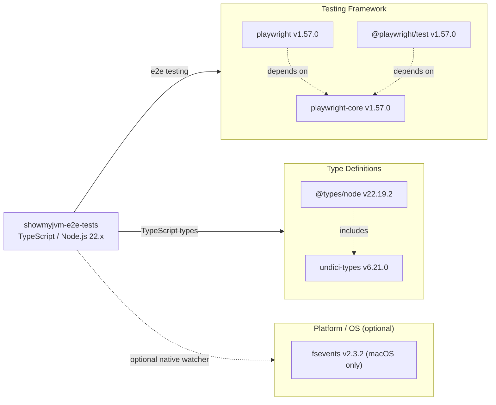

# Dependency Map

The `showmyjvm-e2e-tests` TypeScript/Playwright project declares **2 direct devDependencies** (4 resolved packages in total after transitive resolution). All dependencies are development/test-scoped; there are no production runtime dependencies.

## Dependencies

> **Note:** All declared dependencies in this project are development/test-scope. There are no production runtime dependencies. The diagram below represents the full dependency set.

### Dependency Summary

| Category | Count | Key Libraries | Notes |
|---|---|---|---|
| Testing Framework | 3 | @playwright/test 1.57.0, playwright 1.57.0, playwright-core 1.57.0 | All at the same version; playwright-core is the shared transport layer |
| Type Definitions | 2 | @types/node 22.19.2, undici-types 6.21.0 | Align with Node.js 22 LTS; undici-types is a transitive type dep |
| Platform (optional) | 1 | fsevents 2.3.2 | macOS file-system watcher, automatically skipped on Linux/Windows |

### Version & Compatibility Risks

The installed version of `@playwright/test` is **1.57.0**, while the declared range in `package.json` is `^1.48.0`. The latest available Playwright release is **1.61.x** (as flagged by the JavaScript assessment). Playwright releases frequently and older minor versions may lack bug fixes and new browser protocol support. `@types/node` is pinned to the `^22.0.0` range (installed 22.19.2), which matches the active Node.js 22 LTS line. However, the assessment detected an available major update to `^25.9.3`, which would target Node.js 25 — a non-LTS release that is not recommended for production use without deliberate intent.

### Notable Observations

- **No production dependencies** — all packages are `devDependencies`; the application ships no runtime JavaScript, only executing tests against external HTTP endpoints.
- **Playwright version drift** — the installed version (1.57.0) is behind the declared range maximum (^1.48.0 resolves up to 1.61.x). Running `npm update` would advance to the latest 1.x release within the declared range.
- **@types/node major update available** — upgrading from `^22` to `^25` aligns types with a non-LTS Node.js line; should be evaluated deliberately rather than automatically accepted.
- **Minimal dependency surface** — with only 2 direct declared dependencies and 6 resolved packages total, the dependency tree is extremely lean, reducing vulnerability exposure and maintenance burden.

## Test Dependencies

| Framework | Version | Scope | Notes |
|---|---|---|---|
| @playwright/test | ^1.48.0 (installed 1.57.0) | devDependency | Full Playwright test runner and assertion library |
| @types/node | ^22.0.0 (installed 22.19.2) | devDependency | TypeScript type definitions for Node.js |

Total test-scope dependencies: **2 direct** (6 resolved including transitives)

All declared dependencies are test/development scoped. The Playwright framework bundles its own assertion library (`expect`), browser binaries, and request context — no additional test helper libraries (e.g., jest-extended, chai) are needed. No contract-testing or integration-test framework beyond Playwright is present, which is appropriate given the project's sole purpose is HTTP endpoint validation.
