# Dependency Map

ShowMyJVM is a Maven multi-module Java project with nine framework implementations plus a .NET Aspire orchestration host. Across all Java modules the project declares approximately 35 runtime/compile-scope external dependencies (excluding internal `showmyjvm-core` cross-module references).

## Dependencies

```mermaid
flowchart LR
    App["ShowMyJVM\nMulti-Module Project"]

    subgraph BOM["BOM / Platform Imports"]
        SpringBOM["Spring Boot BOM 4.0.0"]
        QuarkusBOM["Quarkus BOM 3.30.3"]
        MicronautBOM["Micronaut Platform 4.8.3"]
        HelidonBOM["Helidon Dependencies 4.3.2"]
    end

    subgraph Web["Web Frameworks"]
        SpringWeb["Spring Boot Starter Web 4.0.0"]
        SpringActuator["Spring Boot Starter Actuator 4.0.0"]
        QuarkusRest["Quarkus REST + Jackson 3.30.3"]
        MicronautNetty["Micronaut HTTP Server Netty 4.x"]
        MicronautRuntime["Micronaut Runtime 4.x"]
        HelidonWebserver["Helidon WebServer 4.3.2"]
        HelidonMP["Helidon MicroProfile Core 4.3.2"]
        Javalin["Javalin 6.7.0"]
        Ratpack["Ratpack Core 1.10.0-milestone-39"]
        SparkJava["Spark Core 2.9.4"]
        TomcatServlet["Jakarta Servlet API 6.1.0"]
    end

    subgraph Serialization["Serialization / JSON"]
        JacksonDatabind["Jackson Databind 2.20.1"]
        JacksonAnnotations["Jackson Annotations 3.30.3"]
        JsonbAPI["Jakarta JSON-B API 3.0.1"]
        Yasson["Eclipse Yasson 3.0.4"]
        SnakeYAML["SnakeYAML 2.x"]
        MicronautJackson["Micronaut Jackson Databind 4.x"]
    end

    subgraph Observability["Observability"]
        HelidonObserve["Helidon Observe Health + Metrics 4.3.2"]
        HelidonMetricsSys["Helidon Metrics System Meters 4.3.2"]
        MicronautValidation["Micronaut Validation 4.x"]
        HelidonMPOpenAPI["Helidon MP OpenAPI 4.3.2"]
        HelidonMPMetrics["Helidon MP Metrics 4.3.2"]
    end

    subgraph Logging["Logging"]
        SLF4JSimple["SLF4J Simple 2.0.16"]
        LogbackClassic["Logback Classic 1.5.21"]
        HelidonJUL["Helidon Logging JUL 4.3.2"]
    end

    subgraph Utilities["Utilities"]
        MicronautHttpClient["Micronaut HTTP Client 4.x"]
        HelidonWebclient["Helidon WebClient 4.3.2"]
        HelidonMPHealth["Helidon MP Health 4.3.2"]
        JerseyJsonBinding["Jersey Media JSON Binding 3.x"]
        Jandex["SmallRye Jandex 3.5.2"]
        MicronautInject["Micronaut Inject 4.x"]
    end

    subgraph Containerization["Containerization"]
        JibPlugin["Jib Maven Plugin 3.5.1"]
        QuarkusJib["Quarkus Container Image Jib 3.30.3"]
    end

    App -->|"BOM imports"| BOM
    App -->|"web layer"| Web
    App -->|"JSON handling"| Serialization
    App -->|"observability"| Observability
    App -->|"logging"| Logging
    App -->|"utilities"| Utilities
    App -->|"packaging"| Containerization

    BOM -.->|"governs"| Web
    BOM -.->|"governs"| Serialization
    BOM -.->|"governs"| Observability
    SLF4JSimple -.->|"used by javalin/ratpack/sparkjava"| Web
    LogbackClassic -.->|"used by micronaut"| Web
```

### Dependency Summary

| Category | Count | Key Libraries | Notes |
|----------|-------|--------------|-------|
| Web Frameworks | 11 | Spring Boot Web 4.0, Quarkus REST 3.30.3, Micronaut Netty 4.x, Helidon SE/MP 4.3.2, Javalin 6.7.0, Ratpack 1.10.0-m39, SparkJava 2.9.4, Jakarta Servlet 6.1.0 | Nine frameworks demonstrate identical endpoints across diverse stacks |
| Serialization / JSON | 6 | Jackson Databind 2.20.1, Jakarta JSON-B 3.0.1, Eclipse Yasson 3.0.4, SnakeYAML | Jackson and JSON-B coexist across different modules |
| Observability | 5 | Helidon Observe 4.3.2, Helidon MP OpenAPI/Metrics, Micronaut Validation | Health and metrics endpoints included in Helidon variants |
| Logging | 3 | SLF4J Simple 2.0.16, Logback Classic 1.5.21, Helidon JUL | Mixed logging implementations across modules |
| Utilities | 6 | Micronaut Inject/HTTP Client, Helidon WebClient, Jersey JSON Binding, SmallRye Jandex | Supporting libraries for DI, HTTP client, and CDI scanning |
| Containerization | 2 | Jib Maven Plugin 3.5.1, Quarkus Container Image Jib | OCI image building without Dockerfiles |
| BOM / Platform | 4 | Spring Boot 4.0.0, Quarkus 3.30.3, Micronaut Platform 4.8.3, Helidon Dependencies 4.3.2 | Centrally managed via showmyjvm-bom |

### Version & Compatibility Risks

Spring Boot has been declared at version **4.0.0**, which requires Java 17+ and represents the latest major release (Spring Framework 7 baseline). **Ratpack 1.10.0-milestone-39** is a pre-release milestone and the Ratpack project has been in low-maintenance mode since 2021 — this is the most significant risk for long-term support. **SparkJava 2.9.4** has similarly seen minimal updates and may be considered a legacy choice. Jackson Databind versions differ across modules (2.20.1 in javalin vs 2.15.2 in sparkjava), which could cause subtle serialisation differences. All modules target **Java 25**, which is the latest release and has no LTS status yet — this may limit compatibility with some tooling.

### Notable Observations

- **Intentional framework diversity**: The project's design goal is to run the same endpoints on nine different Java web frameworks simultaneously — dependency duplication is by design, not technical debt.
- **Mixed Jackson versions**: `javalin` declares Jackson Databind 2.20.1 while `sparkjava` pins 2.15.2; keeping these in sync via the BOM would prevent potential classpath conflicts if both jars appear in a combined deployment.
- **Ratpack milestone dependency**: `ratpack-core 1.10.0-milestone-39` is a non-stable release in a project with no recent GA releases, making this module a modernisation candidate.
- **No persistence or messaging dependencies**: The application is intentionally stateless — there are no JDBC drivers, ORMs, or message broker clients, which simplifies cloud migration considerably.

## Test Dependencies

| Framework | Version | Scope | Notes |
|-----------|---------|-------|-------|
| JUnit Jupiter (junit-jupiter) | 5.11.4 | test | BOM-managed; used in core and helidon/helidon-mp modules |
| Mockito Core | 5.20.0 | test | BOM-managed; available for all modules |
| Hamcrest All | (managed by Helidon BOM) | test | Used by helidon and helidon-mp integration tests |
| Helidon WebServer Testing JUnit5 | 4.3.2 | test | Helidon SE integration test support |
| Helidon MP Testing JUnit5 | 4.3.2 | test | Helidon MicroProfile integration test support |
| Playwright (`@playwright/test`) | ^1.48.0 | devDependency (Node.js) | E2E test suite in `e2e-tests/` directory |
| `@types/node` | ^22.0.0 | devDependency (Node.js) | TypeScript definitions for Node.js in E2E tests |

Total test-scope dependencies: 7

JUnit 5.11.4 is the current stable release and is well-supported. The E2E suite relies on Playwright for cross-framework HTTP endpoint validation. No contract-testing library (e.g., Pact) is present, which means API contract drift between framework modules must be caught by the Playwright suite alone.
