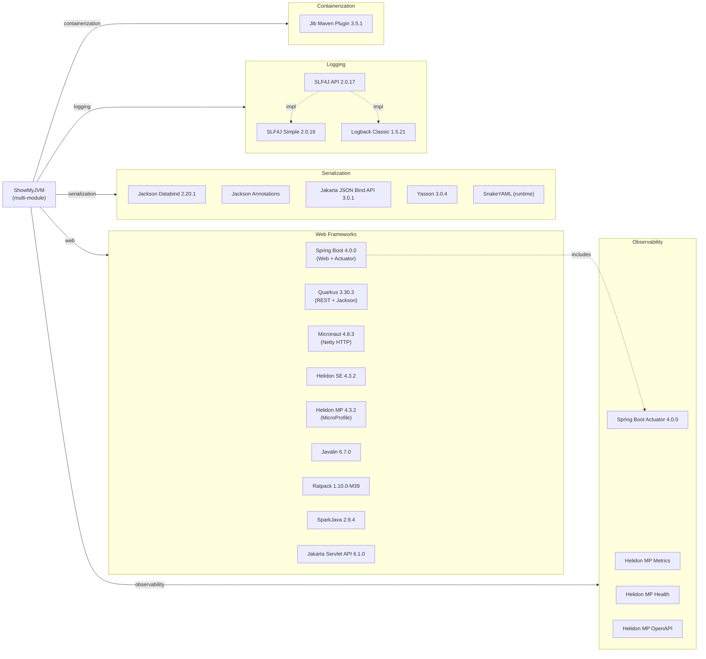

# Dependency Map

ShowMyJVM is a Maven multi-module project with 9 framework implementations sharing a single core library. Across all modules it declares approximately 35 distinct external dependencies (excluding test scope).

## Dependencies

### Dependency Summary

| Category | Count | Key Libraries | Notes |
|----------|-------|---------------|-------|
| Web Frameworks | 9 | Spring Boot 4.0, Quarkus 3.30, Micronaut 4.8, Helidon SE/MP 4.3, Javalin 6.7, Ratpack 1.10, SparkJava 2.9, Jakarta Servlet 6.1 | Nine distinct frameworks in one project for comparison purposes |
| Observability | 4 | Spring Boot Actuator, Helidon MP Metrics, Helidon MP Health, Helidon MP OpenAPI | Only Spring Boot and Helidon MP expose metrics/health endpoints |
| Serialization | 5 | Jackson Databind 2.20.1, Jakarta JSON Bind API 3.0.1, Yasson 3.0.4, SnakeYAML | Two JSON binding stacks (Jackson for most, JSON-B for Tomcat/Helidon MP) |
| Logging | 3 | SLF4J API 2.0.17, SLF4J Simple 2.0.16, Logback Classic 1.5.21 | Consistent use of SLF4J facade; implementation varies by framework |
| Containerization | 1 | Jib Maven Plugin 3.5.1 | Dockerfile-free image builds for all modules |

### Version & Compatibility Risks

Spring Boot 4.0.0 and Quarkus 3.30.3 are current releases. SparkJava 2.9.4 is from 2022 and the project appears largely unmaintained (last release 2022); the framework has no active LTS. Ratpack 1.10.0-milestone-39 is a milestone (pre-release) version that may lack long-term support. Both SparkJava and Ratpack are candidates for replacement with actively maintained alternatives. Jackson Databind 2.15.2 (used in sparkjava module) is older than the 2.20.1 version used elsewhere — this inconsistency should be aligned. SnakeYAML is pulled in as a runtime dependency by Micronaut; its transitive version should be verified against known CVEs.

### Notable Observations

- **Intentional framework proliferation**: The nine web framework dependencies are not redundant — each lives in its own Maven module and the project's purpose is cross-framework comparison. They do not conflict at runtime.
- **Dual JSON binding stacks**: Jackson is used by Spring Boot, Quarkus, Micronaut, and Javalin; Jakarta JSON Bind (Yasson) is used by Tomcat and Helidon MP. This adds maintenance surface but is appropriate given the framework constraints.
- **SparkJava EOL risk**: `spark-core 2.9.4` relies on Jetty 9 internally, which is end-of-life; this is the highest migration risk among the nine frameworks.
- **Version inconsistency**: Jackson Databind appears at two versions (2.15.2 in sparkjava, 2.20.1 in javalin) across modules — the BOM does not pin this dependency centrally, creating a drift risk.

## Test Dependencies

| Framework | Version | Notes |
|-----------|---------|-------|
| JUnit Jupiter | 5.11.4 (BOM) / 5.14.1 (core) | Minor version drift between BOM and core module override |
| Mockito Core | 5.20.0 | Declared in BOM, available to all modules |
| SLF4J Simple (test scope) | 2.0.17 | Used as test logging backend in core module |
| Helidon MP Testing | 4.3.2 | Helidon-specific test CDI container |
| JUnit Jupiter API | 5.x | Used in Helidon SE/MP test scope |

Total test-scope dependencies: **5**

Test coverage is limited to the core module and Helidon integration tests. The eight other framework modules (Spring Boot, Quarkus, Micronaut, Javalin, Ratpack, SparkJava, Tomcat) have no declared unit tests — functional validation is handled entirely by the Playwright E2E suite in `e2e-tests/`.
