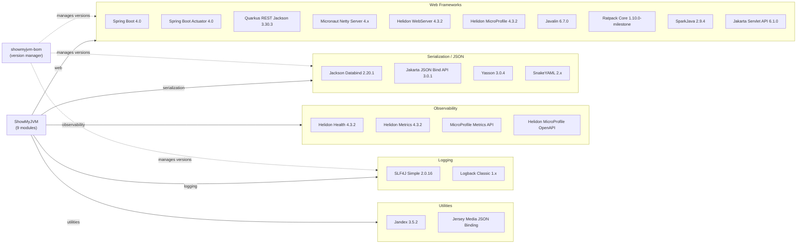

# Dependency Map

ShowMyJVM is a Maven multi-module Java 25 project with 9 framework implementation modules and one core library. The project declares approximately 30 external production dependencies across modules, plus a small set of test dependencies managed via a central BOM.

## Dependencies

### Dependency Summary

| Category | Count | Key Libraries | Notes |
|----------|-------|--------------|-------|
| Web Frameworks | 10 | Spring Boot 4.0, Quarkus 3.30, Micronaut 4.8, Helidon 4.3, Javalin 6.7, Ratpack 1.10, SparkJava 2.9, Tomcat (Jakarta Servlet 6.1) | Each module uses one framework independently |
| Serialization / JSON | 4 | Jackson Databind 2.20.1, Jakarta JSON Bind API 3.0.1, Yasson 3.0.4, SnakeYAML | Multiple JSON libraries due to framework diversity |
| Observability | 4 | Helidon Health, Helidon Metrics, MicroProfile Metrics API, Helidon MicroProfile OpenAPI | Observability is framework-specific; Spring Boot uses Actuator |
| Logging | 2 | SLF4J Simple 2.0.16, Logback Classic | SLF4J used across most modules; Logback in Micronaut module |
| Utilities | 2 | Jandex 3.5.2, Jersey Media JSON Binding | Used in Helidon MP for annotation indexing |

### Version & Compatibility Risks

**Ratpack 1.10.0-milestone-39** is a milestone (pre-release) version, suggesting the stable Ratpack 2.x line has not been adopted; Ratpack development has been largely dormant. **SparkJava 2.9.4** has had no significant updates since 2022 and the project appears to be in maintenance mode, making it a candidate for replacement. **Jackson 2.15.2** used in the SparkJava module lags behind the 2.20.x line used in Javalin — this inconsistency could cause serialization behavior differences across modules. All framework versions (Spring Boot 4.0, Quarkus 3.30, Micronaut 4.8, Helidon 4.3) are current as of 2025/2026.

### Notable Observations

- **No shared web layer**: Each of the nine framework modules manages its own HTTP server/runtime independently; there is no shared web infrastructure, which is intentional but means nine separate dependency trees.
- **Jackson version inconsistency**: The SparkJava module pins Jackson Databind at 2.15.2 while the Javalin module uses 2.20.1 — these should be consolidated via the BOM to avoid version drift.
- **No database, cache, or messaging dependencies**: ShowMyJVM is a pure JVM introspection tool with zero persistence or integration dependencies, which greatly reduces cloud migration risk.
- **Ratpack milestone dependency**: `ratpack-core:1.10.0-milestone-39` is a pre-release artifact that should not be used in production; the Ratpack module should be evaluated for replacement with a stable framework alternative.

## Test Dependencies

| Framework | Version | Scope | Notes |
|-----------|---------|-------|-------|
| JUnit Jupiter | 5.11.4 | test | Unit testing across all modules |
| Mockito Core | 5.20.0 | test | Mocking framework for unit tests |
| Helidon WebServer Testing JUnit5 | 4.3.2 | test | Integration testing for Helidon SE module |
| Helidon MicroProfile Testing JUnit5 | 4.3.2 | test | Integration testing for Helidon MP module |
| Hamcrest All | 1.3 | test | Matcher library used in Helidon tests |
| Playwright | latest (npm) | e2e | End-to-end browser test automation |

Total test-scope dependencies: 6

JUnit 5 and Mockito are managed centrally via the BOM, ensuring consistent versions. The e2e-tests directory uses Playwright via npm and is decoupled from Maven. No contract-testing or integration test framework beyond framework-specific Helidon testing utilities is present in the core modules.
