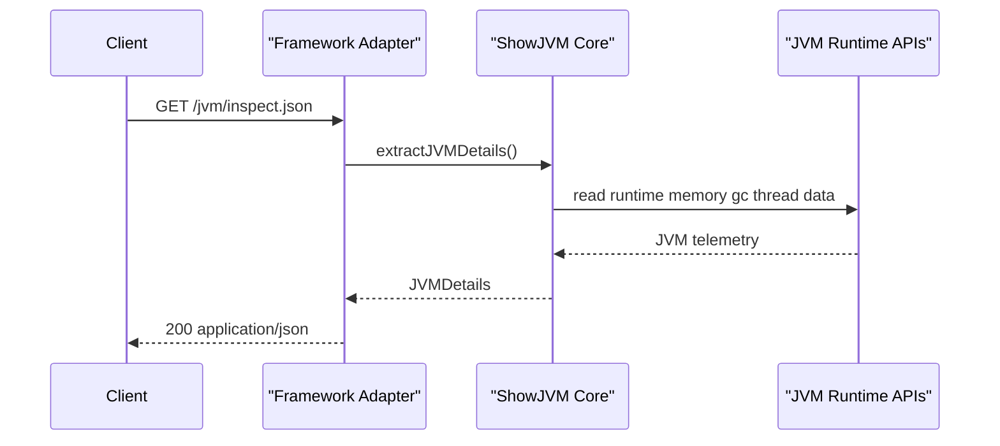

# API & Service Communication Contracts

The repository exposes a compact API surface centered on JVM inspection with consistent synchronous HTTP contracts across framework-specific modules.

## Service Catalog

| Service | Port | Category | Purpose |
| --- | --- | --- | --- |
| spring-boot | `${PORT:8080}` | API Layer | Spring Boot adapter for JVM inspection endpoints |
| quarkus | `${PORT:8080}` | API Layer | Quarkus adapter for JVM inspection endpoints |
| micronaut | `${PORT:8080}` | API Layer | Micronaut adapter for JVM inspection endpoints |
| helidon | `${PORT or 8080}` | API Layer | Helidon SE adapter for JVM inspection endpoints |
| helidon-mp | `${PORT:8080}` | API Layer | Helidon MP adapter for JVM inspection endpoints |
| javalin | `${PORT or 8080}` | API Layer | Javalin adapter for JVM inspection endpoints |
| ratpack | `${PORT or 8080}` | API Layer | Ratpack adapter for JVM inspection endpoints |
| sparkjava | `${PORT or 8080}` | API Layer | SparkJava adapter for JVM inspection endpoints |
| tomcat | container configured | API Layer | Servlet-based adapter for JVM inspection endpoints |
| core | n/a | Business | Shared JVM analysis library consumed by all adapters |

## API Endpoints Inventory

| Service | Method | Path | Request Type | Response Type |
| --- | --- | --- | --- | --- |
| All adapter services | GET | `/jvm/inspect` | none | `text/plain` JVM report |
| All adapter services | GET | `/jvm/inspect.json` | none | JSON `JVMDetails` payload |

## Management & Observability Endpoints

| Service | Endpoint | Custom Metrics (if any) |
| --- | --- | --- |
| spring-boot | `/actuator/*` via starter actuator | Framework default actuator metrics |
| helidon / helidon-mp | health and metrics observe endpoints | Framework default health and metrics |
| Other adapters | none explicitly declared in repo | none identified |

## DTOs & Contracts

The primary contract model is `JVMDetails` from the core module, returned as JSON for `/jvm/inspect.json`. Plain-text responses are generated from `ShowJVM` and represent the same runtime domains in formatted text form. No OpenAPI, protobuf, or GraphQL schema files are defined in the repository.

## Communication Patterns

Communication is synchronous request-response HTTP between client and one selected framework adapter. Adapters call shared core classes in-process; no asynchronous messaging or inter-service network calls were identified. Retry, circuit-breaker, and timeout policies are not explicitly configured for inter-service calls because no downstream services are invoked. API security controls such as authentication, authorization, and TLS enforcement are not declared in module source/configuration.

## Service Technology Matrix

| Service | Web | Data Access | Discovery | Gateway | Actuator | Cache | Metrics |
| --- | --- | --- | --- | --- | --- | --- | --- |
| spring-boot | Spring MVC | none | none | no | yes | no | yes |
| quarkus | Quarkus REST | none | none | no | no | no | no |
| micronaut | Micronaut HTTP | none | none | no | no | no | no |
| helidon / helidon-mp | Helidon web and MP | none | none | no | yes | no | yes |
| javalin | Javalin | none | none | no | no | no | no |
| ratpack | Ratpack | none | none | no | no | no | no |
| sparkjava | SparkJava | none | none | no | no | no | no |
| tomcat | Servlet | none | none | no | no | no | no |

## Service Communication Sequence

