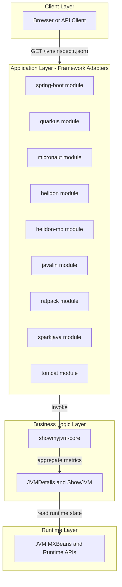
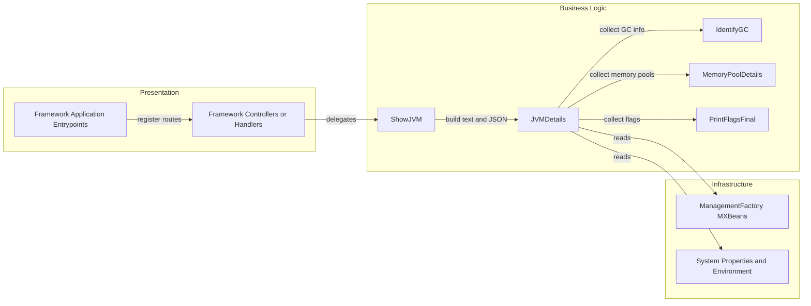

# Architecture Diagram

ShowMyJVM is a multi-module Java application where multiple framework-specific web adapters expose a shared JVM introspection core library through standardized HTTP endpoints.

## Application Architecture

### Technology Stack Summary

| Layer | Technology | Version | Purpose |
| --- | --- | --- | --- |
| Presentation | Spring Boot, Quarkus, Micronaut, Helidon, Javalin, Ratpack, SparkJava, Tomcat | Managed in module POMs / BOM | Expose HTTP endpoints for JVM inspection |
| Core logic | Java library (`showmyjvm-core`) | 1.0.0-SNAPSHOT | Collect and format JVM details |
| Runtime | Java 25 + JMX/MXBeans | Java 25 | Source of runtime, memory, GC, and thread data |

### Data Storage & External Services

No persistent database, cache, or message broker is configured in the repository. The application reads in-process runtime data from JVM management interfaces and returns it directly through HTTP responses.

### Key Architectural Decisions

- Shared core library centralizes JVM introspection logic while each module provides framework-specific HTTP wiring.
- All adapters standardize on `/jvm/inspect` and `/jvm/inspect.json` for portability and cross-framework parity.
- `PORT` environment variable support is consistently used to make deployments platform-friendly.

## Component Relationships

### Component Inventory

| Component | Layer | Type | Responsibility |
| --- | --- | --- | --- |
| Application classes per framework | Presentation | Entry point | Boot framework runtime and bind HTTP server |
| Jvm inspect handlers/controllers | Presentation | Route handlers | Handle `/jvm/inspect` and `/jvm/inspect.json` |
| ShowJVM | Business Logic | Facade service | Produce plain-text dump or structured details |
| JVMDetails | Business Logic | Aggregator | Assemble runtime, memory, GC, thread, and environment data |
| IdentifyGC / MemoryPoolDetails / PrintFlagsFinal | Business Logic | Helper components | Gather focused JVM subdomain details |
| Java MXBeans and runtime APIs | Infrastructure | Platform APIs | Provide low-level JVM telemetry |
