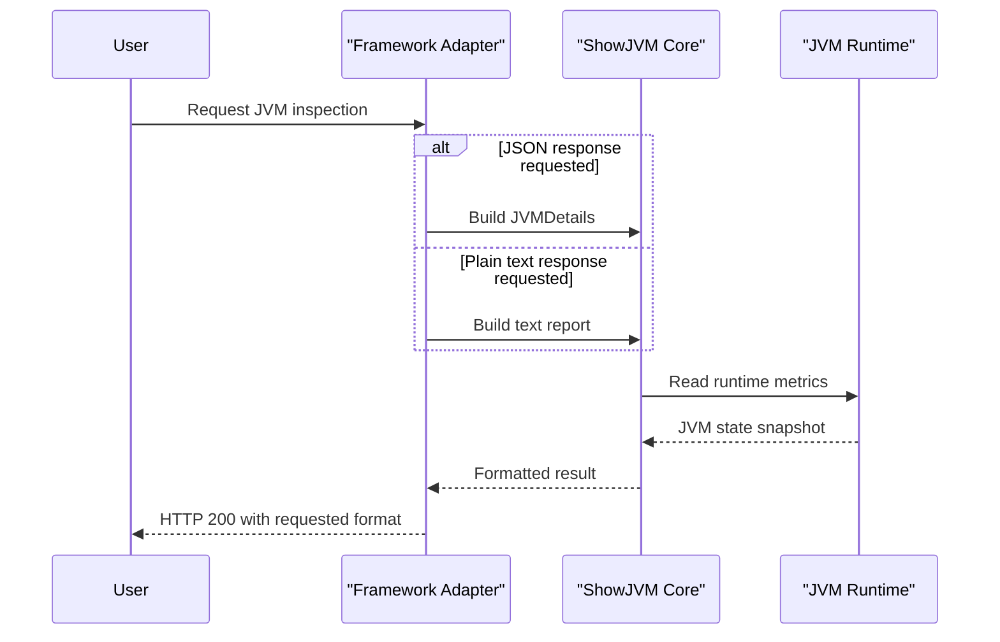

# Core Business Workflows

The application domain is JVM introspection delivery: users request runtime diagnostics and receive either human-readable or structured JSON representations.

## Domain Entities

| Entity | Service / Bounded Context | Description | Key Relationships |
| --- | --- | --- | --- |
| JVMDetails | Core introspection | Aggregate runtime snapshot returned to API clients | Produced by ShowJVM and consumed by all adapters |
| Garbage collector and memory detail models | Core introspection | Represent JVM subsystem metrics | Contained in JVMDetails |
| Plain text JVM report | Adapter delivery | Formatted diagnostic output for humans | Derived from same core telemetry |

## Service-to-Domain Mapping

| Service | Domain Context | Owned Entities | External Dependencies |
| --- | --- | --- | --- |
| showmyjvm-core | JVM introspection | JVMDetails and subordinate telemetry models | JVM runtime management APIs |
| framework adapter modules | API delivery | HTTP response representations | showmyjvm-core |

## Primary Workflows

### Workflow 1: Inspect JVM in plain text

1. User calls `GET /jvm/inspect` on any adapter module.
2. Adapter invokes core `ShowJVM` text generation.
3. Core gathers runtime information from JVM APIs.
4. Adapter returns formatted text diagnostics.

### Workflow 2: Inspect JVM in JSON

1. User calls `GET /jvm/inspect.json`.
2. Adapter invokes core JSON extraction.
3. Core assembles `JVMDetails` snapshot.
4. Adapter returns JSON payload with runtime and memory data.

## Cross-Service Data Flows

There is no distributed business data flow between independent backend services. Each adapter executes in-process calls into the shared core library and returns the composed result directly to the caller. No fallback composition across multiple remote services is required.

## Business Workflow Sequence

## Business Rules & Decision Logic

- Endpoint format selection rule: `/jvm/inspect` returns text and `/jvm/inspect.json` returns JSON.
- The application gathers live JVM state at request time rather than persisting historical snapshots.
- All framework adapters enforce the same domain behavior by delegating to shared core logic.
