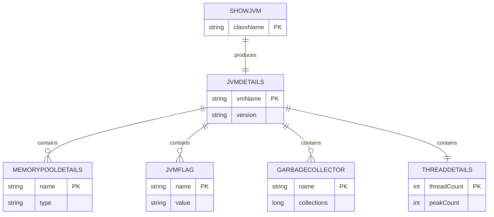

# Data Architecture & Persistence Layer

The application is largely stateless and does not persist business data; its data layer is centered on in-memory JVM runtime telemetry mapped into response models.

## Database Configuration

| Service/Module | DB Type | Profile | Driver | Connection | Migration Tool |
| --- | --- | --- | --- | --- | --- |
| All modules | None configured | n/a | n/a | n/a | n/a |

## Data Ownership per Service

| Service | Tables Owned | ORM Framework | Caching | Notes |
| --- | --- | --- | --- | --- |
| core | none | none | none | Owns in-memory JVM domain model classes |
| all framework adapters | none | none | none | Read-only projection of core model over HTTP |

## Entity Model

## Key Repository Methods

| Service | Repository | Notable Methods | Purpose |
| --- | --- | --- | --- |
| core | none (no repository layer) | `ShowJVM.dumpJVMDetails()`, `ShowJVM.extractJVMDetails()` | Aggregate JVM runtime data for text/JSON contracts |

## Caching Strategy

No explicit caching provider, cache regions, or TTL policies were identified. Responses are generated from live JVM state on each request.

## Data Ownership Boundaries

Data storage is isolated to process memory and JVM management interfaces; no shared or external datastore is used. All modules consume the same core model in-process and do not exchange persisted state across network boundaries.

### Data Classification & Sensitivity

| Entity | Sensitive Fields | Classification (PII/PHI/PCI/None) | Controls in Place |
| --- | --- | --- | --- |
| JVMDetails and related runtime models | JVM/system metadata and environment variables | None | No persistence; values exposed via runtime endpoint payloads |

