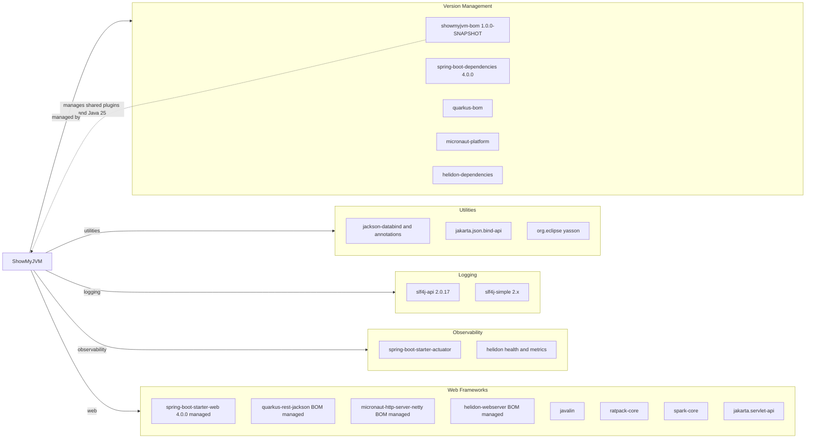

# Dependency Map

ShowMyJVM is a Maven multi-module Java project with framework-adapter dependencies around a shared core library; dependencies are primarily web runtimes, observability libraries, and logging utilities.

## Dependencies

### Dependency Summary

| Category | Count | Key Libraries | Notes |
| --- | --- | --- | --- |
| Web Frameworks | 8 | Spring Boot Web, Quarkus REST, Micronaut HTTP, Helidon Web, Javalin, Ratpack, SparkJava, Servlet API | One adapter module per framework |
| Observability | 2 | Spring Actuator, Helidon health and metrics | Health and metrics features are framework-specific |
| Logging | 2 | slf4j-api, slf4j-simple | Core uses SLF4J abstraction |
| Utilities | 3 | Jackson, JSON-B API, Yasson | Serialization support across adapters |
| Version Management | 5 | showmyjvm BOM plus framework BOMs | Centralized dependency version alignment |

### Version & Compatibility Risks

The project targets Java 25 and uses framework BOM-managed dependencies; environments without JDK 25 fail compilation. Mixed framework families increase operational surface area even though the business capability is the same.

### Notable Observations

- The shared `showmyjvm-core` library avoids duplicated JVM-inspection logic across all adapters.
- Most modules are intentionally thin and rely on framework starter bundles instead of deep custom dependency trees.
- Test dependencies are mostly JUnit 5 and framework test harnesses, isolated by module.

## Test Dependencies

| Framework | Version | Notes |
| --- | --- | --- |
| JUnit Jupiter | 5.11.4 to 5.14.1 | Standard unit-testing framework across modules |
| Mockito Core | 5.20.0 | Present in BOM for mocking |
| Helidon testing JUnit5 | BOM managed | Used in helidon modules |
| Hamcrest | BOM managed | Assertion helpers in helidon tests |

Total test-scope dependencies: 4

Test infrastructure is present for unit and module-level tests; end-to-end coverage is implemented separately in the Playwright `e2e-tests` project.
