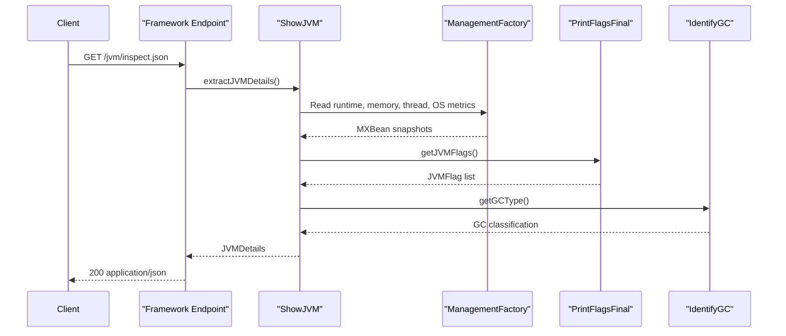

# API & Service Communication Contracts

ShowMyJVM exposes a deliberately small HTTP surface: each Java framework module publishes the same two GET endpoints and delegates directly to the shared core library. Communication is entirely synchronous and in-process, with no broker, no downstream API calls, and no resilience middleware beyond framework defaults.

## Service Catalog

| Service | Port | Category | Purpose |
|---|---:|---|---|
| spring-boot | 8080 via `PORT` | API Layer | Spring Boot adapter with actuator support |
| quarkus | 8080 via `PORT` | API Layer | Quarkus REST adapter for the shared JVM inspection contract |
| micronaut | 8080 via `PORT` | API Layer | Micronaut controller-based adapter |
| helidon | 8080 via `PORT` | API Layer | Helidon SE HTTP service adapter |
| helidon-mp | 8080 via `PORT` | API Layer | Helidon MP JAX-RS adapter with MP health and metrics |
| javalin | 8080 via `PORT` | API Layer | Minimal Javalin route-based adapter |
| ratpack | 8080 via `PORT` | API Layer | Ratpack handler-based adapter |
| sparkjava | 8080 via `PORT` | API Layer | Lightweight SparkJava adapter |
| tomcat | 8080 inside container | API Layer | Servlet-based adapter for Tomcat deployment |
| aspire apphost | 15082 or 17085 in dev | Infrastructure | Starts a containerized Tomcat implementation for local orchestration |

## API Endpoints Inventory

| Service | Method | Path | Request Type | Response Type |
|---|---|---|---|---|
| All Java API services | GET | `/jvm/inspect` | None | `String` plain-text JVM report |
| All Java API services | GET | `/jvm/inspect.json` | None | `JVMDetails` JSON document |
| tomcat | GET | `/jvm/*` | Path suffix only | Either text, JSON, or 404 plain text |
| aspire apphost | N/A | No application endpoints | N/A | Orchestration only |

## Management & Observability Endpoints

| Service | Endpoint | Custom Metrics (if any) |
|---|---|---|
| spring-boot | `/actuator/*` | Framework-provided actuator metrics; no custom metric names declared |
| helidon | `/observe/health`, `/observe/metrics` | Helidon observe health and system meter support |
| helidon-mp | `/health`, `/openapi`, MicroProfile metrics endpoints | MicroProfile metrics support declared; REST request metrics disabled by default |
| aspire apphost | Local dashboard and OTLP helper URLs from launch settings | Development-only Aspire dashboard plumbing |

## DTOs & Contracts

The primary response contract is `JVMDetails`, a mutable Java DTO assembled by `ShowJVM`. It contains runtime, memory, thread, GC, operating-system, system-property, and environment-variable sections. Nested contract types include `MemoryPoolDetails` for memory-pool snapshots and `PrintFlagsFinal.JVMFlag` for JVM option records. The plain-text endpoint does not use a request or response DTO beyond the generated text buffer. No gateway-level aggregation DTOs, protobuf schemas, or GraphQL contracts are present. Serialization is handled by each framework's native JSON stack: Jackson in Spring, Quarkus, Micronaut, Javalin, Ratpack, and SparkJava; JSON-B in the Tomcat and Helidon-based modules.

## Communication Patterns

All service communication is synchronous and local to the process. HTTP requests enter a framework-specific controller, handler, or servlet, which immediately calls `ShowJVM` and returns the generated result. There are no asynchronous message flows, no service discovery client, no API gateway, no retries, no circuit breakers, and no timeout policies declared in application code. The only orchestration relationship is the Aspire AppHost starting a Tomcat container for local development. Security posture is minimal by design: no TLS termination, authentication, authorization, JWT validation, or role checks are configured in the inspected modules, so the inspection endpoints are publicly accessible wherever the process is exposed.

## Service Technology Matrix

| Service | Web | Data Access | Discovery | Gateway | Actuator | Cache | Metrics |
|---|---|---|---|---|---|---|---|
| spring-boot | Spring MVC | None | None | No | Yes | No | Yes |
| quarkus | JAX-RS | None | None | No | No | No | No |
| micronaut | Micronaut HTTP | None | None | No | No | No | No |
| helidon | Helidon SE | None | None | No | Health and observe | No | Yes |
| helidon-mp | JAX-RS / MicroProfile | None | None | No | Yes | No | Yes |
| javalin | Javalin | None | None | No | No | No | No |
| ratpack | Ratpack handlers | None | None | No | No | No | No |
| sparkjava | SparkJava | None | None | No | No | No | No |
| tomcat | Servlet | None | None | No | No | No | No |
| aspire apphost | Aspire orchestration | None | None | No | N/A | No | Dashboard only |

## Service Communication Sequence

