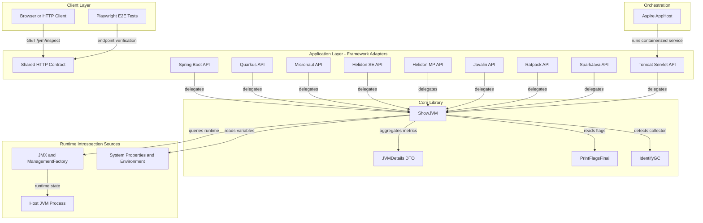
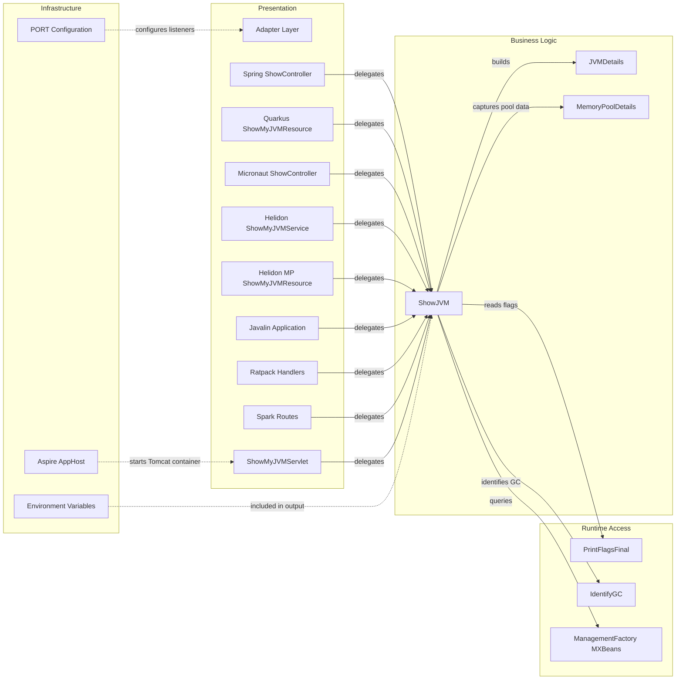

# Architecture Diagram

ShowMyJVM is a multi-module demonstration application that exposes the same JVM introspection capability through multiple Java web frameworks plus a small .NET Aspire app host. The shared core library gathers runtime diagnostics and each framework module adapts that library to a uniform HTTP contract.

## Application Architecture

### Technology Stack Summary

| Layer | Technology | Version | Purpose |
|---|---|---:|---|
| Client | Playwright, curl, browsers | N/A | Exercise the shared inspection endpoints |
| Presentation | Spring Boot, Quarkus, Micronaut, Helidon, Javalin, Ratpack, SparkJava, Tomcat | Mixed | Expose `/jvm/inspect` and `/jvm/inspect.json` over HTTP |
| Core Logic | showmyjvm-core on Java | 1.0.0-SNAPSHOT / Java 25 target | Collect JVM details and format text or JSON responses |
| Orchestration | .NET Aspire AppHost | 9.5.2 / net9.0 | Launch containerized implementations during local development |
| Runtime Source | JMX MXBeans, system properties, environment variables | JDK built-ins | Provide process, memory, GC, thread, and OS details |

### Data Storage & External Services

The application does not integrate with a database, cache, message broker, or third-party API. Its only runtime dependencies are the host JVM management interfaces, environment variables, and framework-provided HTTP servers. The Aspire host references a local Tomcat container image for orchestration rather than an external managed service.

### Key Architectural Decisions

- A single `showmyjvm-core` library owns the introspection logic so every framework module serves the same data contract.
- Each framework module is independently runnable and reads the `PORT` environment variable instead of relying on a shared gateway.
- The .NET Aspire project is an orchestration companion, not a business service; it starts containerized implementations for local composition.

## Component Relationships

### Component Inventory

| Component | Layer | Type | Responsibility |
|---|---|---|---|
| ShowController | Presentation | Spring MVC controller | Maps Spring Boot requests to the core library |
| ShowMyJVMResource | Presentation | JAX-RS resource | Exposes Quarkus and Helidon MP JSON and text endpoints |
| ShowMyJVMService | Presentation | Helidon HTTP service | Registers Helidon SE routes under `/jvm` |
| Application | Presentation | Javalin bootstrap | Creates lightweight HTTP routes and starts the server |
| Ratpack handlers | Presentation | Ratpack handlers | Render plain-text and JSON views of the shared DTO |
| Spark routes | Presentation | Spark route definitions | Return text and JSON payloads for the shared contract |
| ShowMyJVMServlet | Presentation | Servlet | Handles `/jvm/*` routing in the Tomcat module |
| ShowJVM | Business Logic | Facade/service | Aggregates runtime data and formats the response |
| JVMDetails | Business Logic | DTO | Carries the structured inspection payload |
| MemoryPoolDetails | Business Logic | DTO | Represents memory-pool snapshots inside `JVMDetails` |
| PrintFlagsFinal | Runtime Access | Helper | Reads JVM flags and exposes them as DTO records |
| IdentifyGC | Runtime Access | Helper | Derives the active garbage collector family |
| ManagementFactory MXBeans | Runtime Access | JDK API | Source for runtime, memory, thread, and OS metrics |
| Aspire AppHost | Infrastructure | Orchestrator | Starts a Tomcat container for local distributed-app runs |
