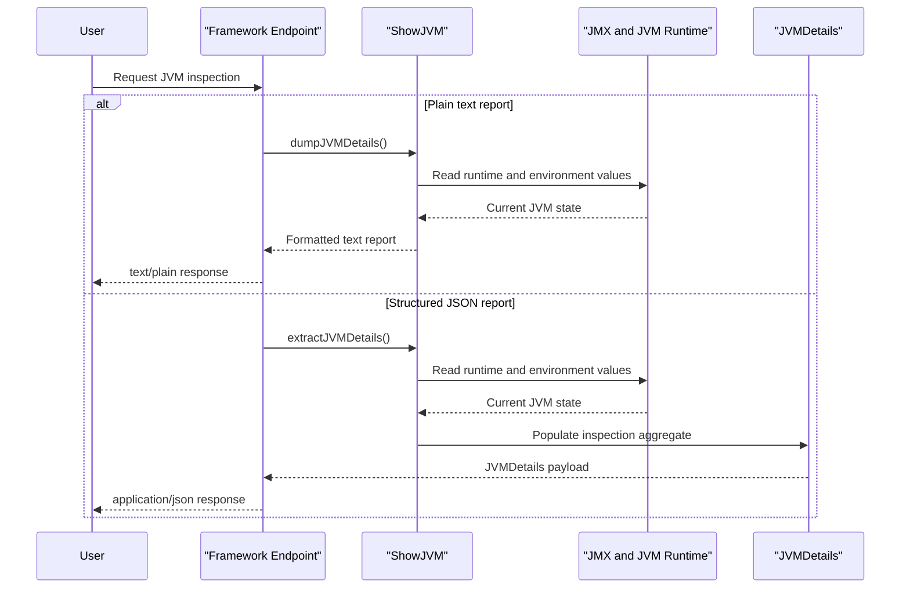

# Core Business Workflows

ShowMyJVM is a diagnostic demonstration application whose primary business purpose is to let users inspect the runtime characteristics of a running JVM through a consistent HTTP contract. Its workflows are simple but repeatable: accept a request, gather live JVM data, and return either a formatted text report or a structured JSON payload.

## Domain Entities

| Entity | Service / Bounded Context | Description | Key Relationships |
|---|---|---|---|
| JVMDetails | showmyjvm-core / Runtime Inspection | Aggregate response object containing runtime, memory, thread, GC, and environment details | Contains many `MemoryPoolDetails` and many `JVMFlag` values |
| MemoryPoolDetails | showmyjvm-core / Runtime Inspection | Snapshot of one JVM memory pool | Owned by `JVMDetails` |
| JVMFlag | showmyjvm-core / Runtime Inspection | One JVM option with origin and writability metadata | Owned by `JVMDetails` |
| Framework adapter request | Each Java API module / Delivery | Framework-specific wrapper around the incoming HTTP GET request | Delegates to `ShowJVM` |

## Service-to-Domain Mapping

| Service | Domain Context | Owned Entities | External Dependencies |
|---|---|---|---|
| showmyjvm-core | Runtime Inspection | `JVMDetails`, `MemoryPoolDetails`, `JVMFlag` | JDK MXBeans, environment variables, system properties |
| spring-boot, quarkus, micronaut, helidon, helidon-mp, javalin, ratpack, sparkjava, tomcat | HTTP Delivery | None persisted; framework-local request and response handling only | `showmyjvm-core` |
| aspire apphost | Local Orchestration | None | Local Tomcat container image |

## Primary Workflows

### Workflow 1: Render plain-text JVM inspection

A client sends `GET /jvm/inspect` to any Java framework module. The framework adapter invokes `ShowJVM.dumpJVMDetails()`, which reads runtime information from JMX and the process environment, formats the data into a multi-section text report, and returns `text/plain` to the caller. The only business rule is contract consistency: every framework implementation must expose the same path and the same content type.

### Workflow 2: Return structured JSON inspection

A client sends `GET /jvm/inspect.json`. The adapter invokes `ShowJVM.extractJVMDetails()`, which assembles a `JVMDetails` aggregate and serializes it using the framework's JSON stack. The workflow preserves live runtime values rather than cached snapshots, so each response reflects the current process state at request time.

### Workflow 3: Launch a containerized example through Aspire

During local development, the Aspire AppHost starts a Tomcat container image and exposes it through an HTTP endpoint mapping. The workflow does not transform business data; it supports developer convenience by making one implementation available under the distributed-application dashboard.

## Cross-Service Data Flows

There are no business microservices exchanging domain data with one another. Instead, each framework module is a separate delivery surface over the same in-process core library. The only composition flow is adapter-to-core: request enters a framework module, the module reads JVM state through `showmyjvm-core`, and the response is returned immediately. If a framework instance is unavailable, clients must retry another running implementation manually because no gateway or fallback composition layer exists.

## Business Workflow Sequence

## Business Rules & Decision Logic

- All supported implementations must expose the same two inspection endpoints so the e2e suite can validate them uniformly.
- The inspection result is generated on demand; no persistence, background refresh, or cache invalidation logic is involved.
- The plain-text and JSON workflows share the same source data, which keeps cross-format output semantically aligned.
- Error handling remains framework-local. The Tomcat servlet returns a 404 plain-text error for unsupported `/jvm/*` suffixes, while other frameworks only register the supported routes.
