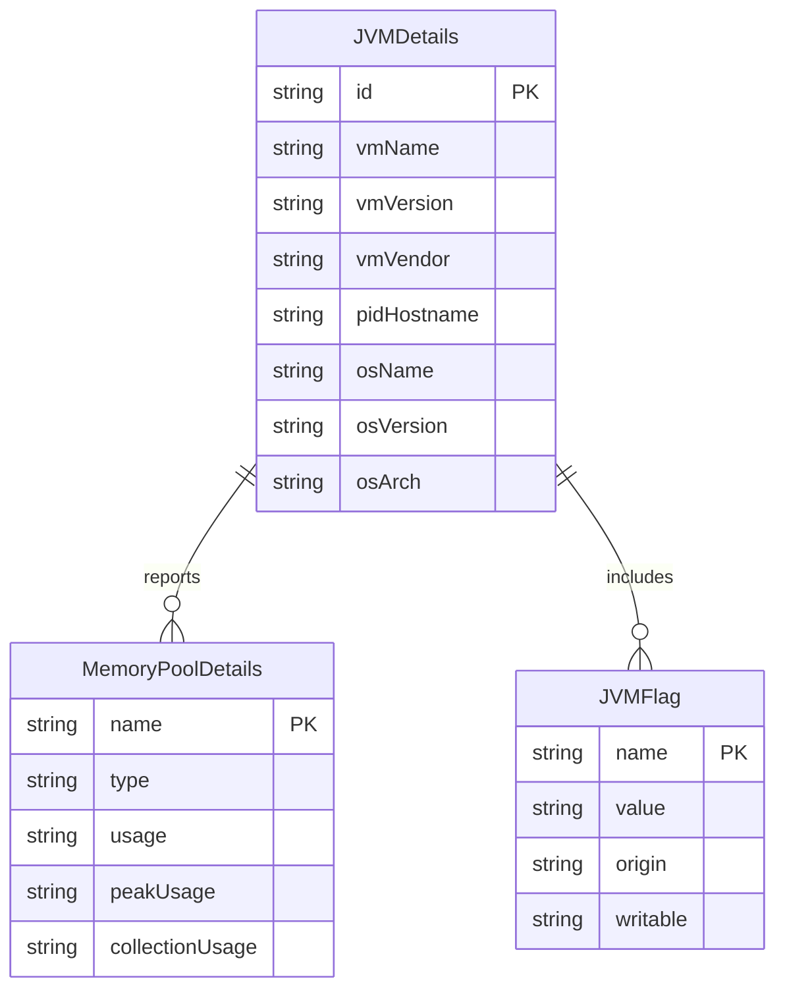

# Data Architecture & Persistence Layer

ShowMyJVM does not use a database or a persistence framework. Its data layer is an in-memory assembly of JVM runtime structures that are read from JDK management APIs and exposed as response DTOs.

## Database Configuration

| Service/Module | DB Type | Profile | Driver | Connection | Migration Tool |
|---|---|---|---|---|---|
| All Java framework modules | None | Default | None | No database connection configured | None |
| aspire apphost | None | Development | None | No database connection configured | None |

## Data Ownership per Service

| Service | Tables Owned | ORM Framework | Caching | Notes |
|---|---|---|---|---|
| showmyjvm-core | None | None | None | Owns the DTO model and runtime extraction logic |
| Framework adapters | None | None | None | Only translate HTTP requests into core-library calls |
| aspire apphost | None | None | None | Orchestrates a containerized Tomcat instance only |

## Entity Model

## Key Repository Methods

| Service | Repository | Notable Methods | Purpose |
|---|---|---|---|
| showmyjvm-core | None | None | No repository abstraction is present; data is read directly from MXBeans |
| Framework adapters | None | None | HTTP handlers call `ShowJVM` directly instead of a data-access layer |

## Caching Strategy

No cache provider, cache annotations, or in-memory caching layer were detected. Every request performs a fresh read of management beans, environment variables, and JVM flags, so responses always reflect current runtime state at the cost of repeated collection work.

## Data Ownership Boundaries

The repository has no persistent data store, no shared schema, and no cross-service database access. Each running framework instance reads process-local runtime state from the same JVM process in which it executes. The only data boundary is between the framework adapter layer and the shared `showmyjvm-core` DTO model.

### Data Classification & Sensitivity

| Entity | Sensitive Fields | Classification (PII/PHI/PCI/None) | Controls in Place |
|---|---|---|---|
| JVMDetails | `environmentVariables`, `systemProperties`, `inputArguments` | None for business data, but operationally sensitive configuration may be exposed | No masking or field-level filtering in the core library |
| MemoryPoolDetails | None | None | No special controls required |
| JVMFlag | JVM option values may reveal infrastructure settings | None for regulated data, operationally sensitive | No masking in code |
