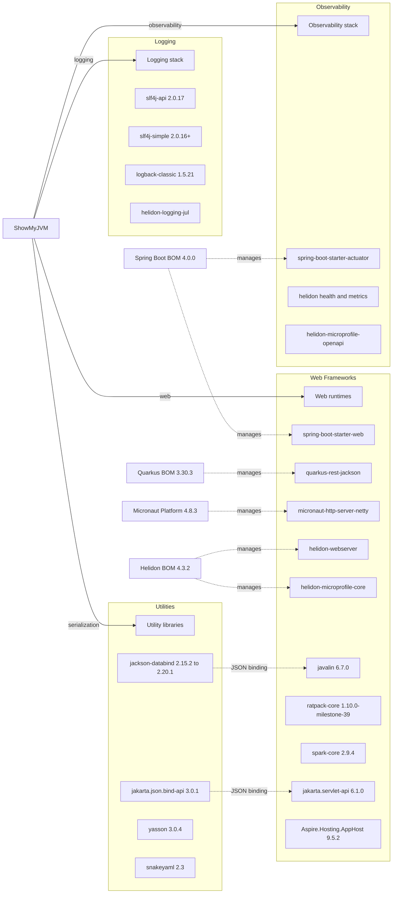

# Dependency Map

ShowMyJVM declares about 44 non-test external dependencies across its Java framework modules and one .NET app host. The dependency surface is dominated by web runtimes, observability add-ons, JSON serialization libraries, and a small amount of logging infrastructure.

## Dependencies

### Dependency Summary

| Category | Count | Key Libraries | Notes |
|---|---:|---|---|
| Web Frameworks | 10 | Spring Boot Web, Quarkus REST Jackson, Micronaut HTTP Server, Helidon WebServer, Javalin, Ratpack, SparkJava, Jakarta Servlet, Aspire AppHost | One shared capability exposed through many independently runnable adapters |
| Observability | 5 | Spring Boot Actuator, Helidon health and metrics, Helidon MP OpenAPI and metrics | Observability is concentrated in Spring and Helidon modules |
| Logging | 4 | SLF4J API, SLF4J Simple, Logback, Helidon JUL bridge | Logging choices vary by framework but remain lightweight |
| Utilities | 8 | Jackson, JSON-B, Yasson, SnakeYAML | Serialization and config parsing are the main utility concerns |
| Internal shared library | 9 module references | showmyjvm-core | Shared dependency omitted from diagram because it is an internal artifact |

### Version & Compatibility Risks

The dependency set mixes very recent framework releases with older libraries such as Ratpack milestone builds and SparkJava 2.9.4. The CVE scan also surfaced several high-severity advisories around Jackson, SnakeYAML, Jetty, Netty, and Spring Boot Actuator, which makes dependency hygiene a central modernization concern even though the application logic is small.

### Notable Observations

- BOM imports are used heavily for Spring Boot, Quarkus, Micronaut, and Helidon, so many concrete versions are inherited rather than declared inline.
- JSON support is duplicated across frameworks through Jackson and JSON-B stacks because each framework adapter uses its native serialization approach.
- Observability dependencies appear only in selected modules, so management endpoint behavior is not fully uniform across all implementations.
- The .NET footprint is intentionally tiny: the repository contains a single Aspire AppHost project that orchestrates containers rather than serving the inspection API itself.

## Test Dependencies

| Framework | Version | Notes |
|---|---|---|
| JUnit Jupiter | 5.11.4 to 5.14.1 | Primary Java unit-test framework across modules |
| Mockito Core | 5.20.0 | Managed in the BOM for Java test mocking |
| Hamcrest | Managed by Helidon BOM | Used in Helidon test assertions |
| Helidon testing JUnit 5 | Managed by Helidon BOM | Provides Helidon SE and MP integration helpers |
| Helidon WebClient | Managed by Helidon BOM | Test-only client for Helidon endpoint checks |
| Playwright | package-lock managed | Used in `e2e-tests` for browser-driven endpoint validation |

Total test-scope dependencies: 8

The repository has both module-level Java tests and a separate Playwright suite for end-to-end verification. Test dependencies are lightweight and framework-specific; there is no dedicated contract-testing or containerized integration-testing library in the current build files.
