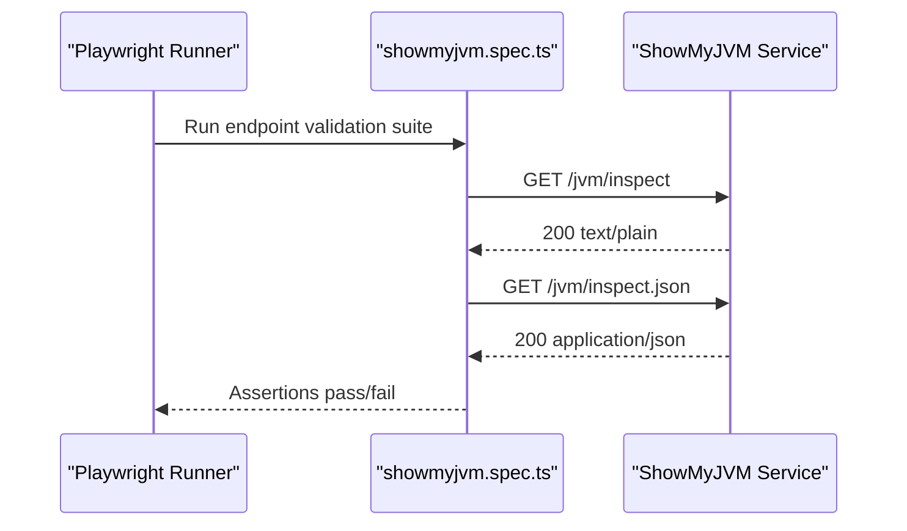

# API & Service Communication Contracts

This document summarizes the API surface exercised by the `e2e-tests` workspace. Communication is synchronous HTTP from Playwright tests to a running ShowMyJVM service.

## Service Catalog

| Service | Port | Category | Purpose |
|---|---:|---|---|
| showmyjvm-e2e-tests | N/A | API Layer | Executes external API validation scenarios |
| showmyjvm-target-service | 8080 | Business | Hosts `/jvm/inspect` and `/jvm/inspect.json` endpoints under test |

## API Endpoints Inventory

| Service | Method | Path | Request Type | Response Type |
|---|---|---|---|---|
| showmyjvm-target-service | GET | /jvm/inspect | No body | text/plain (200) |
| showmyjvm-target-service | GET | /jvm/inspect.json | No body | application/json (200) |

## Management & Observability Endpoints

| Service | Endpoint | Custom Metrics (if any) |
|---|---|---|
| showmyjvm-e2e-tests | Playwright HTML report output | None detected |

## DTOs & Contracts

The workspace does not define local DTO classes for API contracts. Contract validation is assertion-based in test specs and verifies response media type and payload shape/content from the target service.

## Communication Patterns

Communication is synchronous HTTP over `http://localhost:8080` using Playwright `APIRequestContext`. No asynchronous messaging, service discovery, circuit breaker, or retry policy is defined in the workspace beyond Playwright test retry behavior. No authentication, authorization, or TLS configuration is present in this test workspace; endpoints are accessed directly over local HTTP.

## Service Technology Matrix

| Service | Web | Data Access | Discovery | Gateway | Actuator | Cache | Metrics |
|---|---|---|---|---|---|---|---|
| showmyjvm-e2e-tests | Playwright test runner | None | None | None | None | None | Playwright reports |
| showmyjvm-target-service | External (not defined in workspace) | External | None | None | External | External | External |

## Service Communication Sequence

