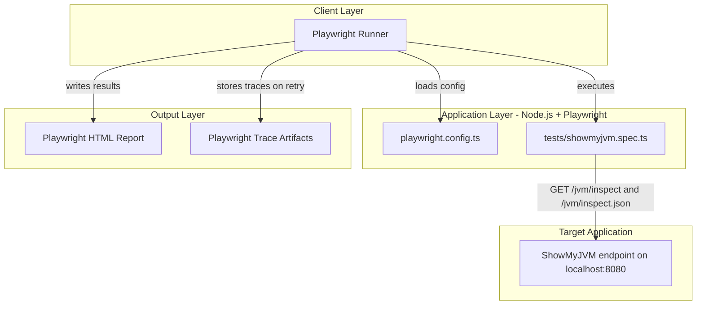
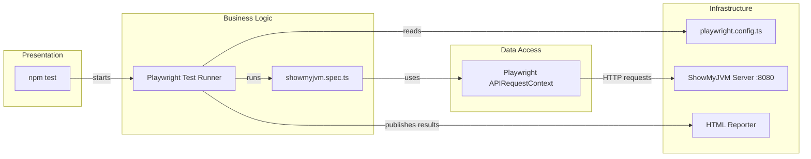

# Architecture Diagram

This document summarizes the E2E test application architecture for the `e2e-tests` workspace and the component relationships used to validate ShowMyJVM endpoints.

## Application Architecture

### Technology Stack Summary

| Layer | Technology | Version | Purpose |
|---|---|---|---|
| Test Runner | Playwright Test | ^1.48.0 | Browser/API-driven end-to-end test execution |
| Runtime | Node.js | 22.22.3 (runtime) | Executes the test toolchain |
| Language Tooling | TypeScript typings | @types/node ^22.0.0 | Type support for test config and scripts |
| Target Integration | HTTP over localhost | N/A | Validates ShowMyJVM endpoints |

### Data Storage & External Services

The E2E test workspace does not define its own database, cache, or message broker. It depends on an externally started ShowMyJVM server running on `http://localhost:8080` and records local test artifacts (HTML report and traces) in the workspace.

### Key Architectural Decisions

- Tests are black-box endpoint checks against a running implementation, not in-process unit tests.
- Base URL is centralized in `playwright.config.ts` to keep endpoint targeting consistent.
- A single Playwright project (`showmyjvm`) is used for uniform validation across implementations.

## Component Relationships

### Component Inventory

| Component | Layer | Type | Responsibility |
|---|---|---|---|
| npm test | Presentation | CLI entrypoint | Starts Playwright test execution |
| Playwright Test Runner | Business Logic | Test orchestrator | Runs suites, retries, and reporting |
| showmyjvm.spec.ts | Business Logic | Test specification | Validates endpoint availability and content |
| APIRequestContext | Data Access | HTTP client API | Sends requests to `/jvm/inspect*` endpoints |
| playwright.config.ts | Infrastructure | Configuration | Defines base URL, workers, retry policy |
| ShowMyJVM Server :8080 | Infrastructure | External dependency | Provides endpoints under test |
| HTML Reporter | Infrastructure | Report output | Produces human-readable test run reports |
