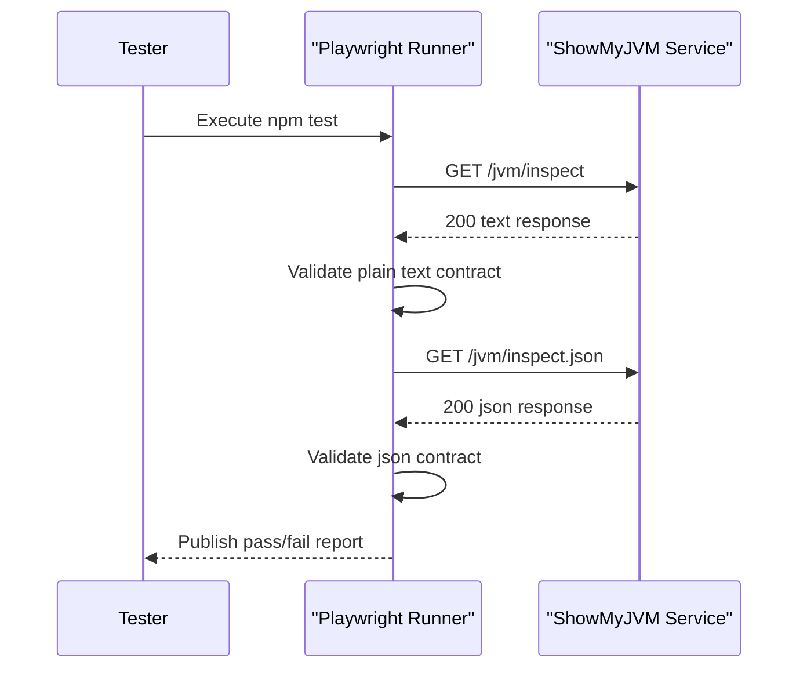

# Core Business Workflows

This workspace verifies that ShowMyJVM implementations satisfy endpoint and content expectations. The main business workflow is end-to-end endpoint validation for text and JSON responses.

## Domain Entities

| Entity | Service / Bounded Context | Description | Key Relationships |
|---|---|---|---|
| EndpointCheck | E2E Validation | Represents validation of a target endpoint response | Linked to response assertions |
| ResponseContract | E2E Validation | Expected content type and shape | Evaluated per endpoint |
| TestRunResult | E2E Validation | Pass/fail outcome for a test execution | Aggregates endpoint checks |

## Service-to-Domain Mapping

| Service | Domain Context | Owned Entities | External Dependencies |
|---|---|---|---|
| e2e-tests | E2E Validation | EndpointCheck, ResponseContract, TestRunResult | Running ShowMyJVM service on localhost:8080 |

## Primary Workflows

### Workflow 1: Validate Plain Text JVM Endpoint

1. Tester starts a ShowMyJVM implementation on port 8080.
2. Playwright executes `should respond to /jvm/inspect with plain text`.
3. Test requests `/jvm/inspect`.
4. Response status and content type are validated.
5. Result is recorded in test output.

### Workflow 2: Validate JSON JVM Endpoint

1. Playwright executes `should respond to /jvm/inspect.json with JSON`.
2. Test requests `/jvm/inspect.json`.
3. Response status and JSON payload expectations are validated.
4. Result is recorded and reported.

## Cross-Service Data Flows

Data flow is request-response only: the test suite sends HTTP GET calls to the target implementation and validates returned payloads. If the target service is unavailable, tests fail with connection errors, representing a clear workflow degradation (validation cannot proceed).

## Business Workflow Sequence

## Business Rules & Decision Logic

- Rule: Target service must be reachable on `localhost:8080` for workflow execution.
- Rule: `/jvm/inspect` must return successful plain-text response.
- Rule: `/jvm/inspect.json` must return successful JSON response.
- Decision logic: Test run outcome is pass only when all endpoint assertions succeed.
