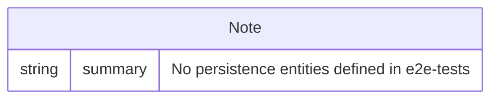

# Data Architecture & Persistence Layer

This workspace is a test harness and has no native persistence model. It consumes HTTP responses from an external service and validates payloads.

## Database Configuration

| Service/Module | DB Type | Profile | Driver | Connection | Migration Tool |
|---|---|---|---|---|---|
| e2e-tests | None | N/A | N/A | N/A | None |

## Data Ownership per Service

| Service | Tables Owned | ORM Framework | Caching | Notes |
|---|---|---|---|---|
| e2e-tests | None | None | None | No local datastore |

## Entity Model

## Key Repository Methods

| Service | Repository | Notable Methods | Purpose |
|---|---|---|---|
| e2e-tests | None | None | No repository layer in workspace |

## Caching Strategy

No cache provider or cache policy is defined in this workspace.

## Data Ownership Boundaries

The e2e-tests module has no owned datastore and no direct data write/read boundary. It only validates externally served API responses.

### Data Classification & Sensitivity

No PII, PHI, or PCI data is persisted by this workspace.
