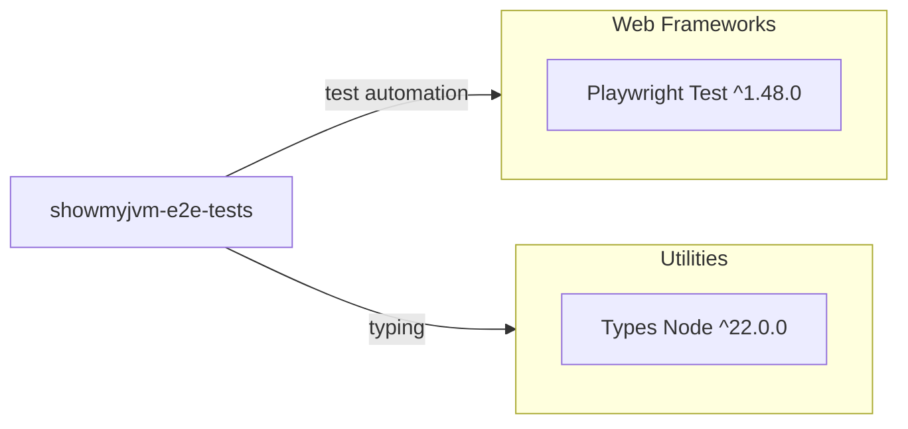

# Dependency Map

This document summarizes declared external dependencies for the `e2e-tests` project. The project has 2 declared dev dependencies and no runtime dependencies.

## Dependencies

### Dependency Summary

| Category | Count | Key Libraries | Notes |
|---|---:|---|---|
| Web Frameworks | 1 | @playwright/test | Core E2E test framework |
| Utilities | 1 | @types/node | Type definitions for Node runtime APIs |

### Version & Compatibility Risks

The dependency set is small and modern. `@playwright/test` and `@types/node` both use caret ranges, so CI reproducibility depends on lockfile control (`package-lock.json`) and periodic compatibility verification.

### Notable Observations

- No production/runtime dependency is declared; this workspace is test-only.
- The dependency footprint is intentionally minimal.
- All declared dependencies are dev-scoped and tied to test execution.

## Test Dependencies

| Framework | Version | Notes |
|---|---|---|
| @playwright/test | ^1.48.0 | Primary E2E test framework and API client |
| @types/node | ^22.0.0 | Type support for configuration and scripts |

Total test-scope dependencies: 2

The test infrastructure is lightweight and centered on Playwright. No additional integration-test library is required for this workspace.
