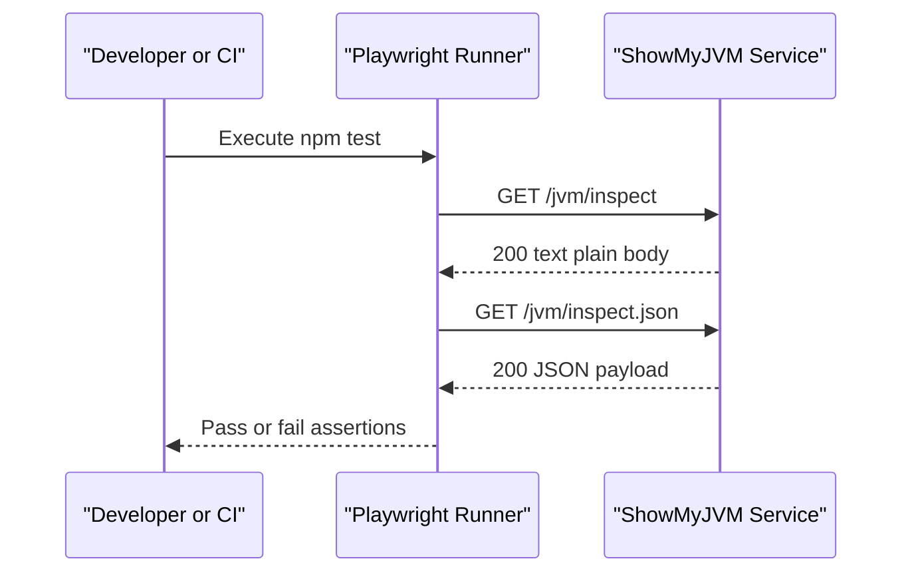

# API & Service Communication Contracts

This subproject provides a test-facing API contract inventory for the ShowMyJVM service under test and uses synchronous HTTP communication.

## Service Catalog

| Service | Port | Category | Purpose |
|---|---:|---|---|
| showmyjvm-target | 8080 | Business | Running JVM-inspection service under validation |
| showmyjvm-e2e-tests | N/A | API Layer | Executes assertions against target endpoints |

## API Endpoints Inventory

| Service | Method | Path | Request Type | Response Type |
|---|---|---|---|---|
| showmyjvm-target | GET | /jvm/inspect | None | text/plain (200) |
| showmyjvm-target | GET | /jvm/inspect.json | None | JSON object (200) |

## Management & Observability Endpoints

| Service | Endpoint | Custom Metrics (if any) |
|---|---|---|
| showmyjvm-target | Not defined in e2e-tests scope | Not identified |

## DTOs & Contracts

The e2e suite validates plain-text and JSON contracts from the target service. The JSON response is asserted to include `vmVendor`, `vmVersion`, `osName`, and `osVersion` as a minimum compatibility contract.

## Communication Patterns

Communication is synchronous HTTP from Playwright request context to the running target service. No async messaging, retries, circuit breakers, service discovery, authentication, authorization, or TLS configuration are defined within the e2e-tests project; endpoints are assumed reachable on localhost.

## Service Technology Matrix

| Service | Web | Data Access | Discovery | Gateway | Actuator | Cache | Metrics |
|---|---|---|---|---|---|---|---|
| showmyjvm-target | HTTP endpoints | N/A in this scope | None | None | Not identified | None | Not identified |
| showmyjvm-e2e-tests | Playwright test runner | HTTP client requests | None | None | N/A | None | Playwright HTML report |

## Service Communication Sequence

