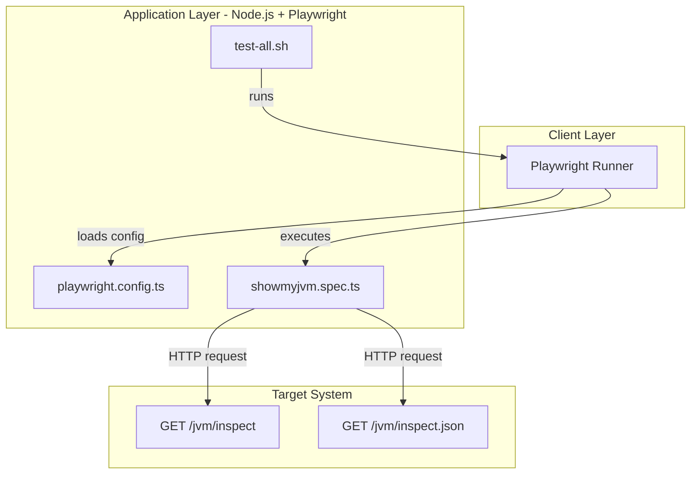
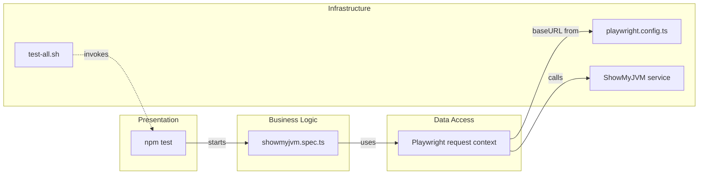

# Architecture Diagram

This document summarizes the e2e-tests subproject architecture and its main component relationships.

## Application Architecture

### Technology Stack Summary

| Layer | Technology | Version | Purpose |
|---|---|---|---|
| Client | Playwright test runner | ^1.48.0 | Execute browser/API end-to-end tests |
| Application | Node.js scripts | Node 18+ (required) | Host and run test commands |
| Test Logic | TypeScript tests | Local project source | Validate ShowMyJVM endpoint behavior |

### Data Storage & External Services

This subproject does not maintain its own database. It interacts with a running ShowMyJVM service at `http://localhost:8080` and validates endpoint behavior over HTTP.

### Key Architectural Decisions

- Configuration is centralized in `playwright.config.ts` with a fixed base URL and retry behavior.
- Tests use API request context directly rather than browser UI flows.
- `test-all.sh` orchestrates multi-implementation validation by starting/stopping framework apps around the same test suite.

## Component Relationships

### Component Inventory

| Component | Layer | Type | Responsibility |
|---|---|---|---|
| npm test | Presentation | Command | Entry-point for the E2E suite |
| showmyjvm.spec.ts | Business Logic | Test spec | Validates endpoint status, headers, and payload shape |
| Playwright request context | Data Access | HTTP client abstraction | Sends requests to running target service |
| playwright.config.ts | Infrastructure | Configuration file | Defines base URL, retries, and project settings |
| test-all.sh | Infrastructure | Shell orchestrator | Runs tests across multiple implementations |
