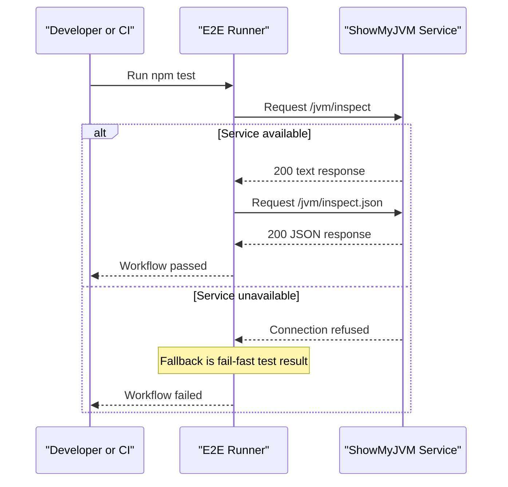

# Core Business Workflows

This workspace supports the quality workflow of validating that ShowMyJVM implementations expose stable and consistent JVM-inspection responses.

## Domain Entities

| Entity | Service / Bounded Context | Description | Key Relationships |
|---|---|---|---|
| Test Scenario | e2e-tests / Validation | Defines expected behavior for endpoints | Executes against target service |
| Endpoint Response | showmyjvm-target / JVM Inspection | Returned payload under validation | Compared with assertions |

## Service-to-Domain Mapping

| Service | Domain Context | Owned Entities | External Dependencies |
|---|---|---|---|
| e2e-tests | Validation & Compliance | Test Scenario | Running ShowMyJVM implementation |
| showmyjvm-target | JVM Inspection | Endpoint Response | JVM runtime and host OS |

## Primary Workflows

### Workflow 1: Validate plain text JVM endpoint

1. Operator starts a framework implementation on port 8080.
2. Playwright test requests `/jvm/inspect`.
3. Response status/content-type/content presence are validated.
4. Workflow succeeds when assertions pass.

### Workflow 2: Validate JSON JVM endpoint

1. Playwright requests `/jvm/inspect.json`.
2. Response must be HTTP 200 with `application/json` content-type.
3. Required JVM fields are validated for compatibility.
4. Workflow succeeds when the JSON contract is satisfied.

## Cross-Service Data Flows

The e2e runner consumes endpoint output from the target service and performs assertion-based validation. No data mutation occurs. If the target service is unavailable, workflow degrades to a failed test run due to connection refusal.

## Business Workflow Sequence

## Business Rules & Decision Logic

- Both required endpoints must respond with HTTP 200.
- `/jvm/inspect` must return `text/plain` with JVM-related content.
- `/jvm/inspect.json` must return JSON containing required core keys.
- Service availability on port 8080 is a prerequisite gate for successful workflow execution.
