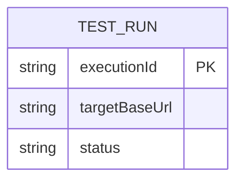

# Data Architecture & Persistence Layer

The `e2e-tests` subproject is a test harness and does not implement a persistence layer. No ORM entities or repository interfaces are defined in this workspace.

## Database Configuration

| Service/Module | DB Type | Profile | Driver | Connection | Migration Tool |
|---|---|---|---|---|---|
| e2e-tests | None | N/A | N/A | N/A | N/A |

## Data Ownership per Service

| Service | Tables Owned | ORM Framework | Caching | Notes |
|---|---|---|---|---|
| e2e-tests | None | None | None | Exercises external service via HTTP only |

## Entity Model

> Note: No application persistence entities were identified in `e2e-tests`; the diagram shows a conceptual test-run artifact only.

## Key Repository Methods

| Service | Repository | Notable Methods | Purpose |
|---|---|---|---|
| e2e-tests | None | None | No repository/data-access layer in this module |

## Caching Strategy

No caching provider, cache regions, or cache policies are defined in this subproject.

## Data Ownership Boundaries

Data is owned by the external ShowMyJVM services being tested. The e2e suite reads endpoint responses and performs assertions without storing domain data.

### Data Classification & Sensitivity

| Entity | Sensitive Fields | Classification (PII/PHI/PCI/None) | Controls in Place |
|---|---|---|---|
| TEST_RUN (conceptual) | None | None | N/A |

No PII, PHI, or PCI data detected in the e2e-tests entity model.
