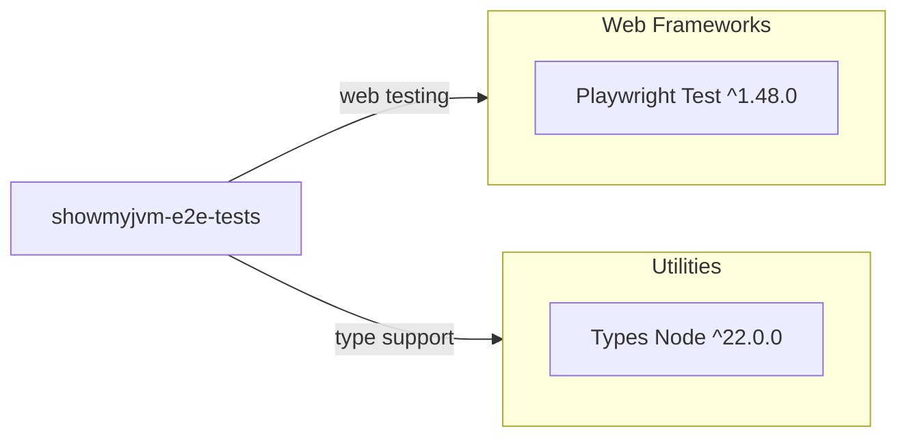

# Dependency Map

This map summarizes declared dependencies for the `e2e-tests` project (2 total declared dev dependencies).

## Dependencies

### Dependency Summary

| Category | Count | Key Libraries | Notes |
|---|---:|---|---|
| Web Frameworks | 1 | @playwright/test | Core E2E test framework and runner |
| Utilities | 1 | @types/node | Type definitions for Node runtime |

### Version & Compatibility Risks

The dependency set is small and modern, but the Playwright version range (`^1.48.0`) may drift over time; periodic locking/review is recommended for deterministic CI behavior.

### Notable Observations

- Only dev dependencies are declared; no runtime production dependencies in this subproject.
- Test execution depends on an externally running service and is not fully self-contained.
- Browser binaries are managed by Playwright tooling, outside `package.json` dependency list.

## Test Dependencies

| Framework | Version | Notes |
|---|---|---|
| @playwright/test | ^1.48.0 | Main test framework and assertions |
| @types/node | ^22.0.0 | Type support for test/runtime scripts |

Total test-scope dependencies: 2
The test stack is lightweight and sufficient for HTTP endpoint verification.
